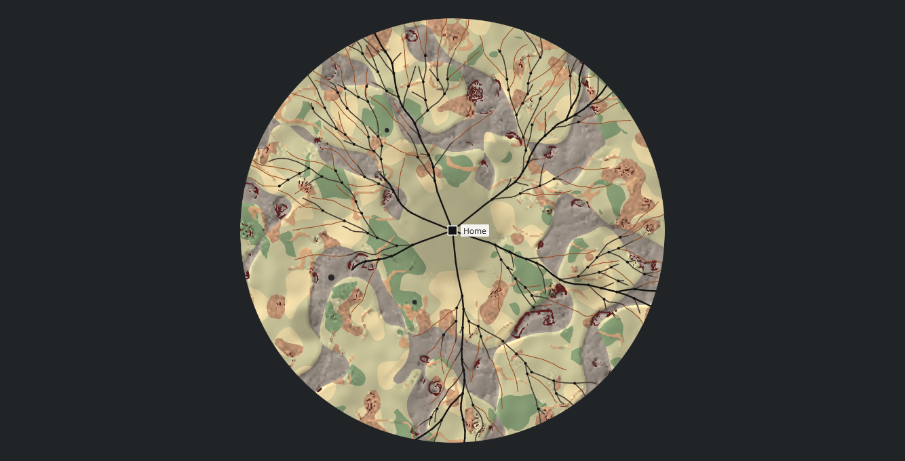
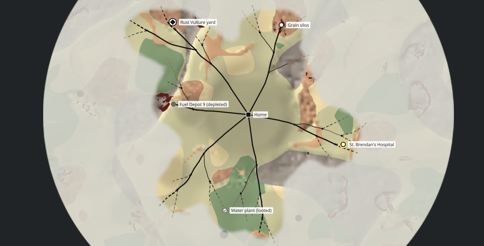

# Area map view (DDB-298)

Date: 2026-10-08. Code: `src/renderer/game/ui/areaMap/` (`AreaMapView.ts`, `MapCamera.ts`, `terrainBake.ts`, `fogBake.ts`, `roadGeometry.ts`, `layers.ts`, `areaMapStyle.ts`), the gallery's `area-map` and `area-map-fog` scenes, and `scripts/area-map-bake-bench.mjs`. Spec: [Area Map Generation](../specs/Area%20Map%20Generation.md) (Performance, Fog), [Compound and Supply Runs](../specs/Compound%20and%20Supply%20Runs.md) (The area map, Fog of war), Game Flow 3.3. Follows [terrain-fields.md](./terrain-fields.md) and [road-growth.md](./road-growth.md).

## Context

The Map Lab (DDB-299) and the area map screen (DDB-43) both draw a generated map: terrain, the drivable roads by class and by what's known of them, junctions, the compound, POIs and strongholds, and fog, with pan, zoom, and selection. The spec fixes the shape of it: terrain and scenery bake into one image per map, rebaked only when the map is generated or loaded, fog draws over it, and roads draw live because their state and highlighting change. The terrain costs about 600 ns a full sample, so a bake at the resolution a zoomed-in view would like (a texel a world unit or less) is seconds, not milliseconds. And half the inputs don't exist yet: POIs and strongholds (DDB-291), tiers (DDB-292), stops (DDB-293), knowledge and fog (DDB-294), scenery (DDB-297).

## One component, drawing through the draw API

- Markers, labels, and junctions as child components, positioned on every pan. Rejected: hundreds of nodes moved every frame of a drag, whose labels the lint would read as sibling overlaps wherever two POIs sit close, and the hit testing a click needs is a distance to a point or a polyline, which the tree doesn't do.
- One component that draws everything itself (chosen). World layers draw under one pushed matrix (R2.4), so a pan or a zoom rebuilds nothing; markers and labels draw in screen space so they keep their size. The labels go to the snapshot through `drawnText`, so the text record (DDB-206) sees them.

What it costs: a POI isn't a focusable child, so there's no Tab to it yet. The view is focusable as a whole (arrows pan, `+` and `-` zoom, `0` fits), and keyboard selection of markers is a follow-up for the area map screen, which knows what a marker opens.

Its `cullInk` is null. The view clips everything it draws to its box, but the walk's development ink audit (DDB-184) measures each draw unclipped, and a road runs past the box whenever the map is zoomed in. Null is what `DrawFixture` says for the same reason; the cost is that the subtree cull can't skip the view's ancestors on its account, and R4.2a still culls each draw.

## Three spaces and the camera

World space is the generator's (y north). Map space is world space with y flipped, and the view keeps its geometry there, so `MapCamera.matrix` is a uniform scale and a translation with no reflection in it, which keeps every SDF and clip on its ordinary path. Screen space is the view's content box. `zoom` is screen pixels per world unit, held between three quarters of the zoom that fits the disc and 4, and the centre is held inside the disc's bounding square, so the map can't be panned away. A fitted camera (`fit(rect)`) refits on every resize until it's moved by hand, which is how a screen frames what's been uncovered (`revealedBounds`) and keeps it framed at any window size.

A drag pans once it passes the drag threshold (R9.12a's tokens), and the dispatcher sends no click after one (R9.31), so a pan never selects. The wheel zooms about the pointer; `canScroll` answers true only while the zoom can still move that way, so inside a scroller the page scrolls once the map is at a limit (R9.32).

## The terrain bake

Measured with `scripts/area-map-bake-bench.mjs` on the 5950X, shared with other work at about 30% load, so each map's time is the fastest of five: the median and the slowest over five environments and three seeds.

| Radius | Texels | Node 24 | Electron 25 |
| --- | --- | --- | --- |
| 600 | 480 (2.5 units each) | 15 ms (19) | |
| 1000 | 800 (2.5) | 45 ms (69) | 52 ms (64) |
| 1200 | 960 (2.5) | 66 ms (101) | |
| 1600 | 1024 (3.1) | 98 ms (155) | 100 ms (121) |

A full sample at every texel would be about 0.6 s at 1024, and `obstacle` alone at every texel is 70 to 105 ms at radius 1600, more than the bake. The bake gets there by reading the land on two lattices coarser than the texels:

- The fields biomes are read from, and the hill shade, every 16 world units. A texel inside one biome's four nodes is that biome; where they differ, it classifies the biome from the fields interpolated at the texel, so a biome's edge is a curve through the lattice. Interpolating the colours instead was a staircase of 16-unit cells, plain at the fit zoom.
- The slope every second texel, filled lazily, so it's sampled only around rough country, the one place a cliff can stand (terrain-fields.md). A texel in rough country is a cliff where the interpolated slope reaches the cliff grade, with its edge anti-aliased over the last 15% of the slope's square. On the steepest corner of the tuning ranges, 75% or more of the ground `obstacle` calls cliff is drawn as full cliff and 85% or more of what's drawn as full cliff is, which a test holds; the rest is the edges.
- Craters are drawn exactly as anti-aliased circles, and water is asked per texel when there is any. The precedence is `obstacle`'s.

The texture covers the disc's bounding square at about 2.5 world units a texel, 256 to 1024 a side. It's made on mount, or when the map changes, which is outside any frame (R2.17), and uploads through the metered queue (R5.32): the disc draws in scrub until it's resident. No copy of the texels is kept (R5.33); a lost context bakes again through `reload`. A row is baked per call: as one long function, V8 entered its loop part way through (on-stack replacement) and deoptimised at the end of every row.

Considered and left: baking off the main thread (a worker would hold the bake off the first frames, and the golden harness photographs a paused page), and refining progressively in `update` (which the paused harness never runs). Either is the lever if a bake has to fit inside a frame; neither is needed for a once-a-map cost.

The picture is soft zoomed in: at the closest zoom a texel is 10 to 12 pixels, magnified by the GPU's bilinear filter, and biome edges show their texels. Roads, junctions, and markers are vectors and stay sharp. A second, finer bake of just the revealed ground is the fix if the area map screen wants a close view to look crisp. Cliffs still end in DDB-288's straight cuts at the edges of rough cells; at the bake's resolution they read as the edge of a rough patch, so they aren't softened.

## Roads

Drivable roads are live `drawPolyline`s, one per stretch, in map space under the camera's matrix: trails, then back roads, then highways, so the widest lie on top. Widths are screen pixels (the colours and widths are `scripts/road-growth.mjs png`'s), thickening gently with the zoom, (zoom / 0.5)^0.4 held to 0.8 to 1.8, so the whole of a 1600 map isn't a tangle and a close view isn't hairlines.

At the fit zoom a smoothed polyline's points are a pixel or less apart. So each stretch keeps coarser copies (Douglas-Peucker at 0.25 world units doubling to 16, built the first time a zoom asks for them), and a frame draws the coarsest that strays under 0.4 pixels. The 1600 map has 10,051 segments; at its fit zoom it draws about 1,300 instances in all, and full detail only from zoom 2, where most of the map is outside the view. Stretches whose bounds miss the view are skipped before the call and counted as culled (R4.2a), so `apiDraws + culled` still counts every group.

Knowledge is per stretch: charted solid, rumored solid but paler (an opaque mix toward the land, since a translucent polyline darkens at its joints), and uncharted a dashed stub where it leaves known road, its parent stretch charted or rumored, or it leaves the compound. An uncharted stretch beyond another is not drawn at all, so the spec's three states say what's hidden without a fourth. A stub's dashes are a constant length on screen and fade over its first 140 world units into the fog; they're built again when the zoom changes and kept while it doesn't. Each dash is a polyline of its own, so it keeps the capsule's anti-aliased edge; a bare triangle list, as the road view's straight dashes are, would be aliased on a curve.

A junction is a dot where its inbound stretch is drawn. The compound is a square at the origin with its label.

## Fog

The land fog is a grid of cells (64 a side in the spec), baked into its own texture at 8 texels a cell, drawn over the terrain and under the roads and markers: a found stronghold and a charted highway show over fog, as the wireframe has them. The grid is blurred once ([1 2 1] each way) before the texels read it bilinear, so the edge rounds the cells' corners instead of running along their sides; it leans toward the hidden side, so no revealed cell is drawn fogged. A bake is about 5 ms, done when the fog is set.

It's a plain pale wash, not the wireframe's hatching. Hatching baked into the map scales with the zoom (at the zoom that frames a starting reveal, the lines were 60 pixels apart and 15 wide), and drawn in screen space it needs a mask the uber shader doesn't take. A wash reads the same at every zoom.

## The inputs for later stages

All optional, each a small interface in `layers.ts`, set as a property:

- `markers: MapMarker[]`: id, kind (`poi` or `stronghold`), world position, label, and a POI's state (`unvisited`, `looted`, `depleted`). DDB-291 and the screens map their POIs onto these.
- `knowledge: RoadKnowledgeLayer`: `knowledgeOf(stretch)` returns `charted`, `rumored`, or `uncharted`. Absent, every road is charted.
- `fog: LandFogLayer`: `cells` and `isRevealed(column, row)`, column 0 west and row 0 south. Absent, nothing is fogged. Set it again after it changes; it's rebaked on every set.
- `layers`: which of terrain, roads, junctions, markers, and fog draw, for the Map Lab's toggles.
- `selection` and `onSelect`: a marker by id, a stretch by id, or null; the callback fires when a click changes it, never for a property set (R8.25). A click picks only what's drawn.

Scenery (DDB-297) isn't an input yet: it bakes into the terrain texture when it exists, which needs a CPU line rasteriser in the bake.

## Draw calls and frame cost

Captured with `scripts/perf-capture.mjs` (`perf-results/ddb-298-area-map.md`): headless Chrome at 1440x882, frame cap and vsync off, on ANGLE D3D11 with an RTX 3090.

| Scene | API draws | GPU draws | Triangles | Frame median | Frame p99 | Render max | Flush max |
| --- | --- | --- | --- | --- | --- | --- | --- |
| `area-map`, radius 1600, whole disc | 503 | 1 | 2,580 | 0.67 ms | 0.96 ms | 0.48 ms | 0.74 ms |
| `area-map-fog`, radius 1000 | 241 | 1 | 1,698 | 0.77 ms | 0.98 ms | 0.19 ms | 0.78 ms |
| `shading`, for scale | 333 | 5 | 1,852 | 0.75 ms | 1.05 ms | 0.38 ms | 0.72 ms |

One GPU draw a frame: the terrain and fog textures take two of the dynamic units (R5.20), and everything else is the uber shader's.

## Consequences

- The Map Lab and the area map screen host the view and set its inputs; neither draws a map of its own.
- The gallery scenes are golden-tested from `tests/visual/web/areaMap.spec.ts`, chromium only, rather than from `support/scenarios.ts`, which another branch had open. Folding them into `SCENE_SCENARIOS` keeps the goldens' names and adds the electron project's.
- The bake's resolution and lattices are starting values. `TEXEL_WORLD_UNITS`, `MAX_BAKE_SIZE`, and `COLOUR_WORLD_UNITS` trade the picture against the bake's time; the bench reports both.
