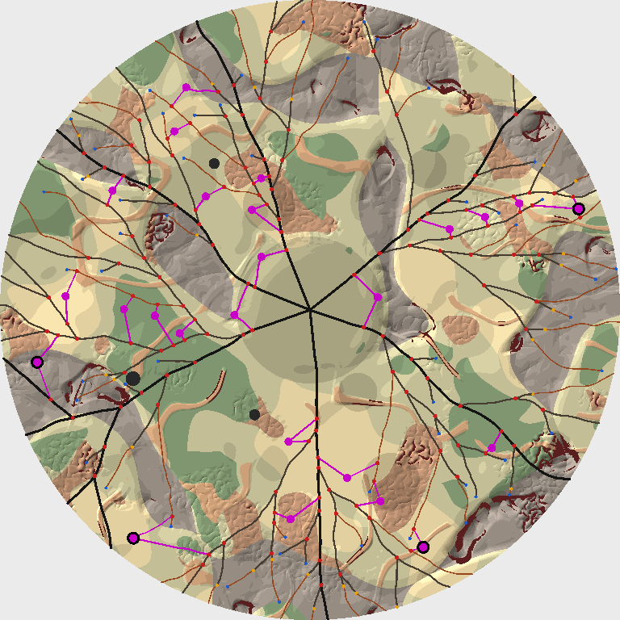
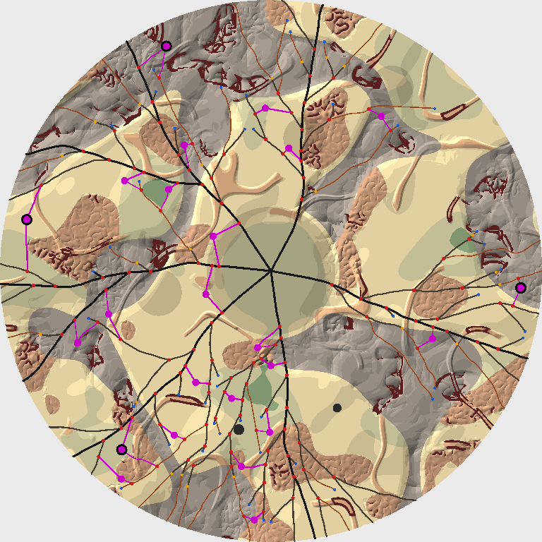

# POIs, approaches, and strongholds (DDB-291)

Date: 2026-10-08. Code: `src/renderer/game/map/` (`Pois.ts`, `PoiData.ts`, `PoiChecks.ts`, `DrivableMap.ts`, and `StepRules.fromNetwork` in `RoadGrowth.ts`), tuning in `src/renderer/game/data/pois.json` and `factions.json`, timed, swept, and drawn by `scripts/road-growth.mjs`. Spec: [Area Map Generation](../specs/Area%20Map%20Generation.md), Pipeline, 5, and Validation and retries. Follows [road-growth.md](./road-growth.md), [terrain-fields.md](./terrain-fields.md), [seeded-prng.md](./seeded-prng.md), and [map-params.md](./map-params.md).

## Context

Stage 5 seats the strongholds, places the POIs, and grows the approach roads that reach them. It owns guarantees 4 (every POI and stronghold is a dead end) and 5 (two routes or more, sharing nothing outside tier 1), and the placement half of 6 (one stronghold per sector, in the outer band). The spec gave the steps and left open what "tier 1" means when tiers don't exist until stage 6, how an approach may bend growth's rules, the output's shape, what each POI type is and yields, how a faction's land is judged, and what to do about the roads DDB-290's QA found stopping short of the rim, about one highway in five, which stage 5 can't move.

Every value here is a starting value for the Map Lab (DDB-299). Two maps, at radius 1000, drawn by `scripts/road-growth.mjs png`: the roads as in road-growth.md, approaches magenta, POIs magenta dots, and strongholds ringed in black.

## What stage 5 returns

`placePois({ terrain, params, network, rng })` takes growth's network and its own stream, root.fork('map', mapAttempt).fork('pois', stageAttempt), and returns either `{ placed: true, map, stats }` or `{ placed: false, sector, stats }` when a sector can't seat its stronghold. `map` is a `PoiMap`, plain JSON like the network:

- `network`: growth's network with the approaches in it. Where an approach leaves a stretch, the stretch is split at a new `junction` node: its inner part keeps its id, the rest are appended, and the stretches that led on from it now lead on from its last piece, so every parent chain still runs to the compound. Each approach is a road of one stretch from that junction to the POI's node, a new node kind `poi`, with the road it leaves as its parent and the piece it leaves as its stretch's parent. A route is still the walk up parents. Grown nodes keep their ids and positions, and the grown roads' polylines are unchanged, piece by piece.
- `strongholds`: `{ node, faction, sector, approaches }`, one per sector in sector order.
- `pois`: `{ node, type, ring, approaches }`, in the order they were placed.
- `homeReach`: the home area's reach in world units along the roads (below).

A dead end an approach carries on becomes an `extension` node, one stretch in and one out; a highway blocked as it left the metro carries on from its `metroEdge`, which keeps its kind. `RoadNetwork`'s `isApproach` and `roadEnd` tell approaches from grown roads by where they end. `checkRoadNetwork` reads approaches by their own rules, and `checkPois` checks guarantees 4 and 5 from the data alone, so the map validator (DDB-296) can run both on a loaded map.

## Tier 1 before there are tiers: the home area

Guarantee 5 is stated in tiers, and stage 6 bands them after stage 5 has run, by travel time on class speeds that don't exist yet. So stage 5 needs a stand-in, and stage 6 has to honour it. The options:

- The metro alone: routes share only city streets. Safe against any tier 1, but then a POI's two groups are always two highway trees (the table below).
- A provisional travel time, guessing class speeds. Stage 6 would then have to match the guess.
- Road distance from the compound (chosen): the home area is the road within the metro's radius plus `home` of the map's radius, measured along the roads. Stage 6 then has one rule to keep: every stretch that ends inside the home area is tier 1.

At `home` 0.25 the home area reaches 0.4 of the radius on a default map, about the first ring of POIs, which is roughly what tier 1 has to hold anyway (guarantee 7 wants three POIs in the starting reveal). A bigger home area seats strongholds more easily and fits more POIs, since more of each tree's branches count as groups of their own, but it's a bigger tier 1 for stage 6 to honour. Measured over 40 campaign rolls, stage 5 run on each of growth's eight attempts with eight streams each, and POIs counted on the maps seated first time:

| `home` | Stage-5 runs that seat every stronghold | Maps seated first time | POIs placed of those aimed for (median) |
| --- | --- | --- | --- |
| 0, the metro alone | 42% | 23 of 40 | 0.24 |
| 0.15 | 62% | 28 of 40 | 0.60 |
| 0.25 (chosen) | 80% | 34 of 40 | 0.80 |
| 0.35 | 89% | 36 of 40 | 0.85 |

## Groups

`routeGroups(network, homeReach)` keys each stretch: walking out from the compound, the first stretch that ends past the home area keys everything beyond it, and a stretch inside the home area keys itself. Two points with different keys have paths that meet only inside the home area: if their shared prefix held a stretch ending past it, that stretch would be the first such for both and key them alike. A point inside the home area keys its own stretch rather than a unique key of its own, so two attach points on one stretch are one group even where the guarantee would let them be two; that keeps a POI from taking two approaches off the same road a few units apart.

## Attach points and approaches

An attach point is a vertex of a grown stretch, `attachSpacing` (10 units) from the last one taken and `nodeMargin` (30) from either end of the stretch, so no stretch is split into a stub, or the tip of a dead end: an `end` node, or a `metroEdge` nothing leaves (DDB-290's QA). For a site, `gather` takes the points within reach whose straight line to it gets no nearer the compound (the line's start is its nearest point) and leaves the road at 20 degrees or more both ways; a dead end's tip has to point at the site within a trail's turn limit instead, since it carries on rather than branching. Points are ranked by distance, the cost estimate, grouped by key, and the groups ranked by their nearest.

For each group in turn, up to `sightChecks` (24) of its points are looked at, nearest first. One whose straight line to the site keeps clear of other roads, by the clearance rule with the approach registered as a branch of the road it leaves, is grown from, up to `triesPerGroup` (2) of them, until one grows. A site stops at `routesTarget` approaches, and gives up when too few groups are left to make two. A site with two or more is placed; otherwise every approach grown for it is retired from the spatial hash.

An approach grows by growth's step rules through `StepRules.fromNetwork({ network, terrain, clearance })`, which registers every grown road with its parent and junction and files every segment, so approaches keep clear of everything grown. Approaches to one site are registered with `setGoal`, so they meet there as a branch meets its parent: near the site they need only the tapered gap, and touch only at the site, 20 degrees or more apart. Against every other road the full clearance holds, which is how the spec's "clearance waived only at the POI itself" comes out. Each step must:

- stay inside the disc;
- come no nearer the compound than where it attached, the spec's relaxed outward rule, checked at the segment's nearest point;
- close on the site all along it: the site lies ahead of the step's end, so the distance to the site only falls. Without it an approach that overshot could loop round and cross itself (one did in 100 maps). With it every point of an approach is nearer the site than every point before, so it can't;
- keep the clearance rule and be passable.

The first step runs straight at the site, as a branch's first step runs along its junction angle. After that each step proposes growth's five headings across the class's turn limit and scores them by travel cost here and 1.5 steps on, by how far they stray from the way to the site (weight 12), and by a draw of noise. Within 1.5 steps of the site it runs straight in if its turn limit allows. It gives up past twice the straight distance. Like growth's stretches it's smoothed with two Chaikin passes and kept smoothed only if that keeps every rule.

An approach's class comes from its terrain: a trail where it leaves a trail, since classes never upgrade outward, or where the mean travel cost along its straight line passes the cost a back road degrades at (`trailThreshold`, by `trailShare`); a back road otherwise. It's never a highway.

## Strongholds

`strongholds` sectors, evenly spaced from a rotation drawn on the stream's `sectors` fork. Each sector draws 96 sites in the outer band (0.8 to 0.95 of the radius) on its own `stronghold` fork, keeps those on open ground (passable, the clearance from every road, the POI spacing from every site) with two groups in reach, and tries them best fit first. A site's fit for a faction is the mean, over the site and six points 40 units round it, of the faction's weight for the biome there plus its ruin weight times `ruin`, plus a jitter drawn once a map per faction (up to 0.1) so close calls vary. The stronghold seats the faction, among those not yet seated, that its site suits best. The first sector that can't seat one fails the stage.

A stronghold's reach is longer than a POI's: the larger of 0.25 of the radius and 5 road clearances, against the larger of 0.12 and 3 for a POI. The outer band is where the network is sparsest: over the same 40 rolls, with the POI's reach a stage-5 run seated every stronghold 44% of the time (22 maps first time, and one map needing a restart), against 80% with the longer one. The median approach is still 0.074 of the radius long, and the longest 0.25.

## POIs

Rings split the way from the metro's edge out to 0.95 of the radius evenly, four of them with targets 5, 7, 9, and 9, times `poiDensity` and rounded. Ring by ring, inner first, darts land evenly over the ring's area, up to 80 per POI aimed for. A dart is kept with a chance of 0.35 away from ruins rising to 1 in them, so ruins hold more POIs, and then has to be open, with two groups in reach, and get its approaches. Sites keep `spacing` apart, the larger of 0.08 of the radius and two clearances, strongholds included.

The targets are aims, not promises. Over 100 campaign rolls the median map placed 0.70 of the POIs aimed for (21 of 30 at density 1), and the leanest tenth under half. Most sites can't reach two groups: away from the home area, two groups means two trees, so POIs gather along the seams between trees and in the first ring, where every stretch is its own group. Three routes are rare for the same reason: 3% of sites got a third approach.

## Types and yields

A POI's type is the first placement rule that holds where it lands, one of the rule's types picked by a draw on the stream's `types` fork:

| Rule | Types | Where |
| --- | --- | --- |
| 1 | hospital, mall | `ruin` 0.5 or more |
| 2 | water plant | elevation under 0.34, or moisture 0.85 or more |
| 3 | fuel depot | within 60 units of a highway |
| 4 | farm, silo | scrub |
| 5 | salvage yard | anywhere |

Over 100 campaign rolls that made salvage yards 30% of POIs, water plants 21%, fuel depots 17%, farms 10%, silos 8%, hospitals 7%, and malls 6%. Yields are per successful run, whole units of the compound's stores (people aside, who come from finds), against a start of 21 food and water, 10 fuel, 3 meds, and 150 scrap: a hospital 3 meds and 10 scrap, a mall 6 food and 20 scrap, a water plant 12 water, a fuel depot 8 fuel, a farm 12 food, a silo 8 food and 4 water, a salvage yard 40 scrap and 2 fuel. Types and yields are read from `pois.json`; the POI keeps only its type, so retuning a yield changes what a type pays without moving a POI. Rivers aren't in the terrain yet (DDB-289), so "by rivers" waits for it: a rule condition is the seam.

## Data files

`pois.json` and `factions.json` are read as their modules load, strictly, as `campaign-start.json` is: an unknown or missing field, a value out of range, a biome or resource that isn't one, a type nothing places, or placement rules that don't end in one that holds everywhere, throws, naming its path. Lengths that scale with the map are `{ share, clearances }`: the larger of `share` of the radius and that many road clearances, so a wide clearance on a small map still leaves room. The ten factions of Faction Concepts are listed, more than the eight strongholds the tuning range allows.

## The rim lever

A stage-5 run can't move a road, so where growth's roads stop short in some sector no run of stage 5 will seat it. The repro from DDB-290's QA, `rollParams(3472152493)`, grows two of six highways to the rim, and all eight stage-5 runs on that network fail. The options:

- Rerun growth when stage 5 runs out (chosen). `layDrivableMap` runs stage 2, then for each of growth's 8 attempts, growth on map.fork('growth', g) and up to 8 runs of stage 5 on map.fork('pois', 8g + r), counting on so no stream runs twice. Only when growth's attempts run out does the caller restart the map with new terrain. On the repro, growth's second attempt seats every stronghold on its first stage-5 run.
- Growth checks outer-band coverage per sector and pushes highways through rough country. Sectors are stage 5's, drawn from its stream, so growth would have to promise coverage at every angle, and pushing a trunk through rough country means relaxing the rules that stopped it, which would move every map and need its own tuning and QA. Rejected for now: the lever above keeps growth as it is and costs a rerun only where a map needs one.

How many stage-5 runs a network should get before growth reruns, over 40 campaign rolls, stages 2 to 5 timed with their retries:

| Stage-5 runs per growth | Maps needing a new map attempt | Stages 2 to 5, median | Slowest | Stage-5 runs, most |
| --- | --- | --- | --- | --- |
| 1 | 0 | 40 ms | 159 ms | 6 |
| 2 | 0 | 40 ms | 177 ms | 11 |
| 4 | 0 | 40 ms | 157 ms | 16 |
| 8 (chosen) | 0 | 38 ms | 91 ms | 9 |

Eight runs per growth, as the spec gives every stage, came out best on the slowest map: a failing stage-5 run is cheap next to a growth, and a new sector rotation fixes most failures that aren't about the roads. Over 100 campaign rolls 94 seated every stronghold on growth's first network, 5 on its second, and 1 on its third, and none needed the map restarted; stages 2 to 5 with their retries took a median of 33 ms and at most 88.

## Where it falls short

Over 150 parameter sets sampled across the tuning ranges, two in five numbers at an end of their range, 11 couldn't seat every stronghold in four map attempts, and 4 more of the property tests' 225 sets; on the first map attempt alone, 25 of the 150 sets `road-growth.mjs check` samples ran stage 5's retries out. All lie in one of two corners:

- Rough: mountains on 0.4 of the land or more and ruggedness 0.7 or more. Highways and approaches give out in cliff country.
- Crowded: seven strongholds, the most the validator leaves, or five or more with a clearance of 0.08 of the radius or more (48 units on a 600 map). Sectors are narrow, and roads keep so far apart that no site has room between two groups.

Not every set in them fails (most of the property tests' do lay a map), and campaign ranges reach neither. Small maps lean on the whole-map restart now and then: at radius 600, the smallest, 2 of 30 maps at the five environments' defaults ran growth's attempts out, and both laid on their second map attempt. The property tests give a set in either corner one map attempt and check what it lays, and require a map of every other set; `inHardCorner` in `roadTesting.ts` names the corners. Narrowing the tuning ranges (open question 5 already asks whether to stop `strongholds` at 7), or a validator clamp on clearance against the radius, would close them; that's for DDB-296's 10,000-map target to settle. A clearance-scaled margin at a stretch's ends, tried to help the crowded corner, seated fewer maps overall (19 of the 150 gave up) and was dropped.

## A growth fix

Approaches end exactly on their POI, so every pair of them touches there, and that turned up an inconsistency in the clearance rule. A segment ending on a junction can measure a hair off it (a + (b - a) needn't round back to b), which gave two roads touching there a tapered gap of a hair rather than none, and which of the two was measured first could decide whether they passed. Growth and the checker could disagree; on one map in 100 they did, at a POI. `junctionDistanceSquared` now counts a segment ending on the junction as on it, exactly, in growth's rule and the checker alike. It moves growth where a step was turned down for that hair: 6 of 120 networks grown on the bench's sampled sets came out different.

## Performance

Measured with `scripts/road-growth.mjs pois` on a Ryzen 9 5950X shared with other work, each map's stage 5 the fastest of five runs on growth's first network and stage 5's first stream, the median and the slowest over the five environments and three seeds:

| Radius | Stage 5, median (slowest) | Stages 2 to 5 with retries, median (slowest) | POIs, median | Seated first time |
| --- | --- | --- | --- | --- |
| 600 | 2.1 ms (4.6) | 14.3 ms (119.6) | 8 | 7 of 15 |
| 1000 | 7.6 ms (11.8) | 33.6 ms (162.7) | 21 | 10 of 15 |
| 1600 | 14.5 ms (25.6) | 92.1 ms (126.6) | 27 | 12 of 15 |

Most of a run is the approaches: each step's clearance query and half-unit passability samples, as growth's, and the straight-line checks before growing. `StepRules.fromNetwork` rebuilds the spatial hash, about a millisecond. A failing run is cheaper than a placing one, since it stops at the first sector it can't seat. Stage 5 alone is a small share of the 200 ms budget. With growth's reruns the slowest map here took 163 ms, which a mid-range laptop could push past the budget, so DDB-296's budget check should time the whole retry loop, not a stage at a time.

## Provisional calls

Gameplay choices the spec left open, made the simplest way consistent with it, for Kevin to approve or adjust:

1. The home area, standing in for tier 1: road within the metro's radius plus 0.25 of the map's radius, along the roads. Stage 6 has to make every stretch that ends inside it tier 1.
2. Strongholds reach further than POIs: 0.25 of the radius (at least 5 clearances) against 0.12 (at least 3).
3. A stronghold seats the faction, among those not yet seated, whose terrain fit its site suits best: per-faction weights by biome and for ruins, in `factions.json` (Mire-Crawlers mire, Dune Striders and Sun Chasers desert, Asphalt Phantoms canyons, Rust Vultures and Gear-Priests ruins, and so on). Factions aren't drawn first and fitted after.
4. The POI types and where they go: hospitals and malls in ruins, water plants on low or wet ground, fuel depots within 60 units of a highway, farms and silos in scrub, and salvage yards everywhere else, which the spec doesn't name.
5. Yields per successful run, in whole units (above). Depletion and refill stay with the campaign (Compound and Supply Runs, POIs).
6. Ring targets don't scale with the map's radius: a bigger map spreads the same POIs further apart.
7. A dead end carries on as an approach only when its site lies within the approach's turn limit of the way it was heading, so an extension never kinks.

## Tests

- `Pois.test.ts`: groups split at the compound and inside the home area but not past it; dead ends, a metro edge among them and a junction a blocked parent ends at not; the closing rule; `StepRules.fromNetwork`, kin at a junction and approaches meeting at their POI against a road bound elsewhere; on hand-built networks, approaches from different highways ending at their site with nothing leaving it, growth's network kept inside the result, a stage that fails while every fork splits past the home area and passes once the home area takes the splits in, factions by terrain, strongholds in the band and their sectors, types by place, ring targets times `poiDensity` and POIs in their rings, spacing, approaches never nearer the compound than where they leave, and determinism with no `Math.random`.
- `Pois.property.test.ts`: over parameter sets sampled across the tuning ranges, `strongholds`, `poiDensity`, and `routesTarget` among them, and over campaign rolls, each laid as the pipeline lays it: `checkRoadNetwork` and `checkPois` find nothing, one stronghold per sector in its sector and the band with a faction each, sites apart and clear of every other road, approaches within their turn limits, the same map again from the same set, and every campaign roll laid on the first map attempt. CI lays 32 maps, `POI_PROPERTY_MAPS` sets more: 300 laid locally (225 sets and 75 rolls) found nothing.
- `DrivableMap.test.ts`: the lever on `rollParams(3472152493)`; the same map from the same seed and another from the next; stop tables and scenery moving nothing in stages 1 to 5.
- `PoiData.test.ts`: the shipped files read back, frozen, and each kind of bad edit is refused with its path.
- `RoadChecks.test.ts`: approaches pass, and one coming nearer the compound, two meeting at their POI under 20 degrees, a POI something leaves, and an approach that's a highway are found.

## Consequences

- Stage 6 (DDB-292) bands tier 1 to cover `homeReach`, or guarantee 5 goes stale: the validator would find routes sharing a tier-2 stretch. Strongholds are tier 5 as the spec says; they sit in the outer band.
- The map validator and retry policy (DDB-296) run `checkRoadNetwork` and `checkPois` and wrap `layDrivableMap` in the map restarts. Its first-attempt pass rate per stage should count stage 5 per network as well as per map. The save keeps the map attempt and growth's and stage 5's winning attempts (DDB-402).
- Routes (DDB-295) walk parents from an approach's stretch, as `route` in `PoiChecks.ts` does.
- Guarantee 7 needs food, water, and fuel POIs inside the starting reveal. About two in five first-ring POIs land in ruins and so are hospitals or malls, and nothing yet makes sure the rest cover water and fuel; whether stage 5 retypes, reruns, or the placement rules change for the first ring is for whoever builds guarantee 7's check.
- The AreaMapView (DDB-298) draws two new node kinds, `poi` and `extension`, and approaches, which are roads like any other.
- POI ids are their places in `pois` and strongholds' in `strongholds`; a stronghold's faction is unique on a map, so the campaign's `strongholdsTaken` can name strongholds by faction.
- A change to any value here, or to the placement rules, moves every map's POIs, so it ships with a generator version bump (DDB-296). Yields don't move anything.
