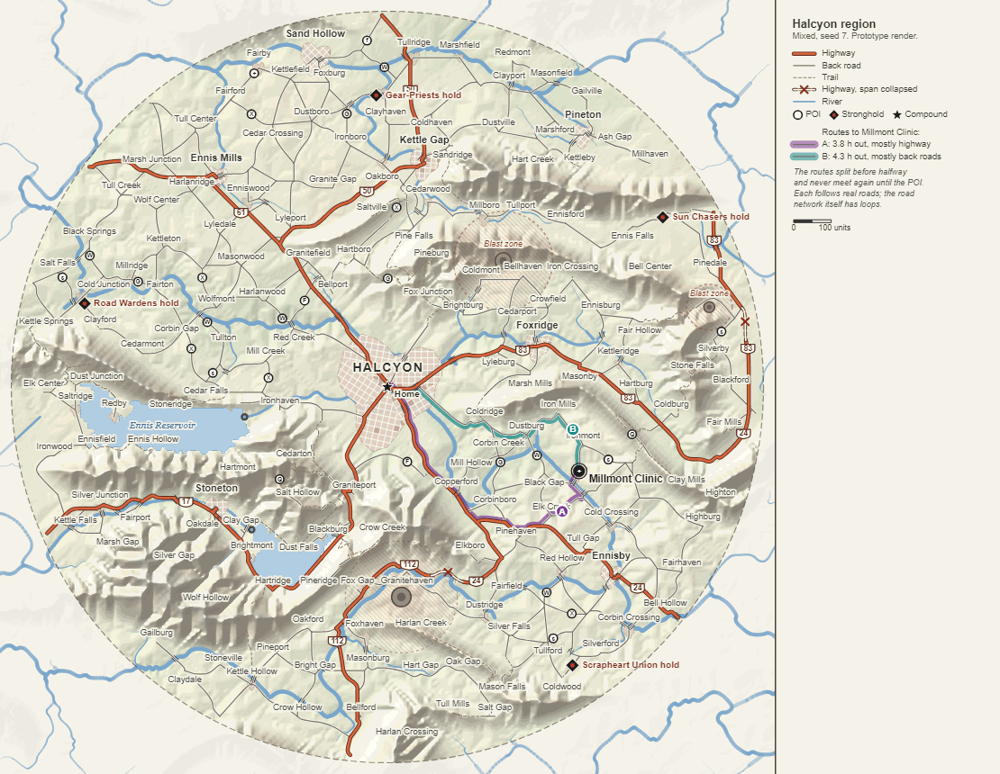
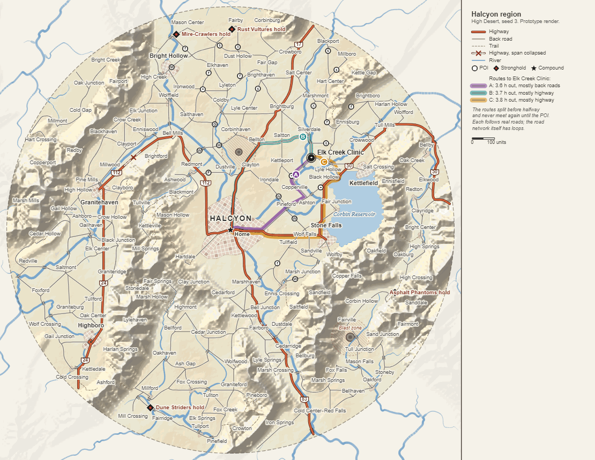
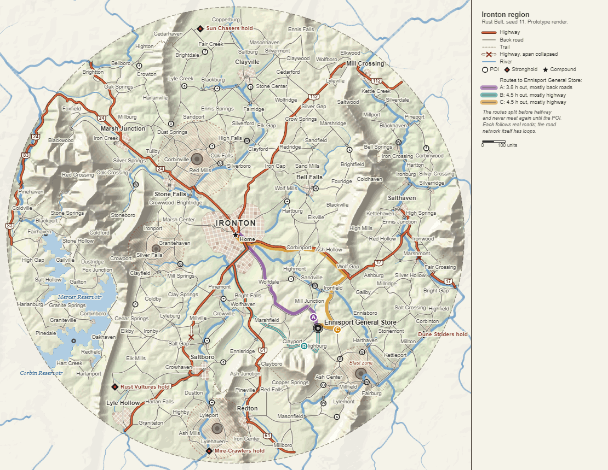
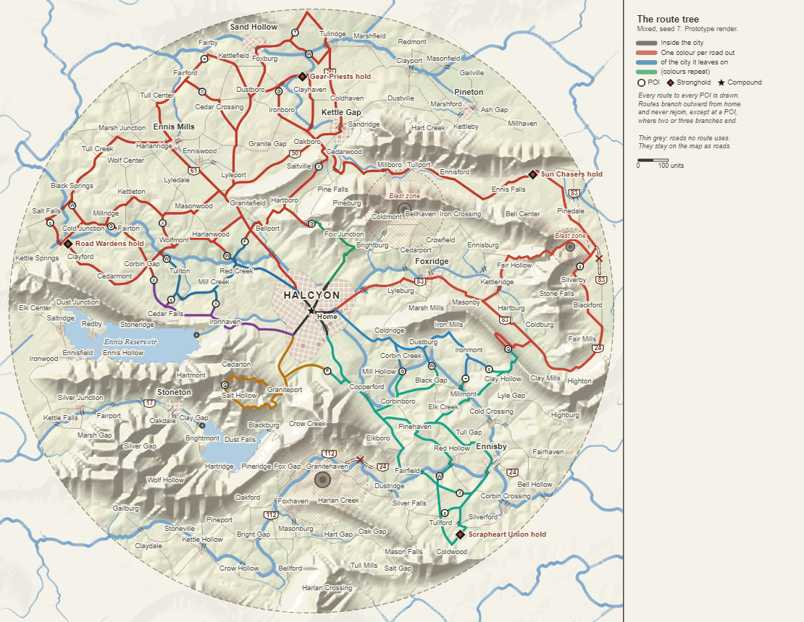
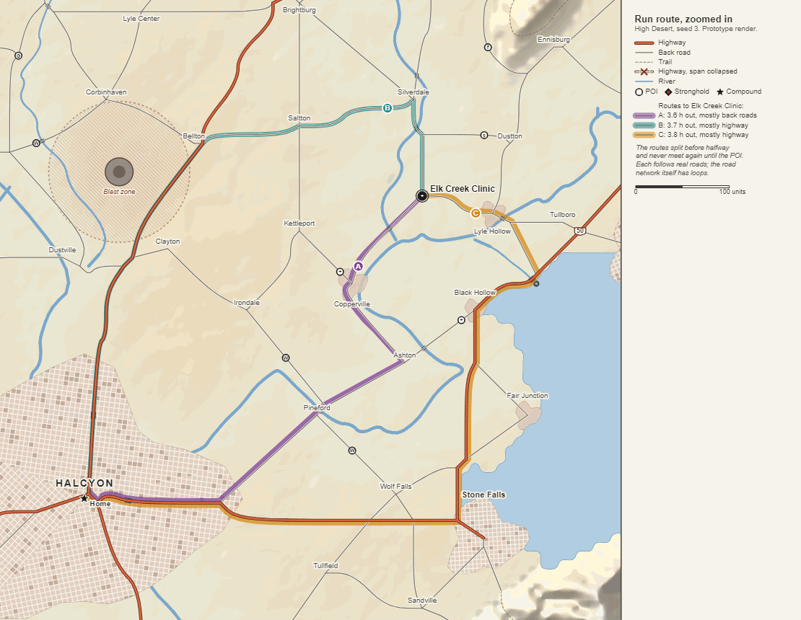

# Realistic geography, a real road network, and tree-shaped routes (DDB-438)

Date: 2026-10-08. Spec: [Area Map Generation](../specs/Area%20Map%20Generation.md), rewritten, and the terms, area map, run route, and fog sections of [Compound and Supply Runs](../specs/Compound%20and%20Supply%20Runs.md). Replaces decisions 2 and 4 of [compound-and-area-map.md](./compound-and-area-map.md). Builds on [terrain-fields.md](./terrain-fields.md), [road-growth.md](./road-growth.md), [map-params.md](./map-params.md), and [seeded-prng.md](./seeded-prng.md), and on the open PRs' area-map-view.md (#176) and pois-and-strongholds.md (#177).

## Context

Kevin, 2026-10-08, after the area map view's renders (#176): "the area map view looks very little like an actual street/region map", and "the geography on the map looks completely unrealistic".

The renders show why. Terrain is thresholded noise: biomes are flat, hard-edged patches that read as camouflage, canyons are grey worms, craters red smears, and there's no water, no valleys, and no ranges. The roads grow as a strict outward tree from the metro, so the network is veins: no towns joined by roads, no loops, no grids. The scenery layer was meant to make up the difference, but county roads drawn lighter than the roads you can drive don't make the drivable ones look real.

Kevin decided the direction, and it's final:

1. The look is a road atlas, like a printed state road map: muted land with soft hillshade, bold cased highways by class, thin grey back roads with trails dashed, ruined towns as street-grid patches, rivers and lakes in blue, place labels.
2. The land and the roads are realistic: rivers carve valleys, mountains form ranges, towns sit where geography puts them, roads follow terrain between towns, and the network has loops like a real one.
3. The routes that follow the roads are tree-shaped: a gameplay layer chosen over the realistic road graph, no longer the shape of the roads.

This record works out what the third one means precisely, picks the methods for the first two, and says what happens to the work already merged or open. Every number it settles is a starting value for the Map Lab; the ones the spec leans on are listed under Provisional calls.

## The prototype

An offline prototype was written to see the target and measure the options: plain JavaScript on Node 24, about 1,500 lines, with headless Chromium drawing the vector layers over a raster the script bakes. It isn't committed and isn't production code; only its renders are, in `docs/design/realistic-map/`. It runs the whole pipeline the spec describes, uplift and erosion to POIs, at radius 1000.

What the renders don't have yet: fog, stops, the stronghold and faction art, rail lines, and pass labels. The colours, widths, and fonts are a first pass, not tuned.

## Decision 1: land from uplift and erosion

Options:

- Keep the noise fields and trace rivers downhill afterwards, as DDB-289 planned. Rejected: noise terrain has pits and ridges in the wrong places, so traced rivers wander or pool, and the land beside them shows no valleys. It's the camouflage with blue lines on it.
- Grow the rivers first and fit the land to them (Génevaux et al. 2013; Red Blob's river-growing experiments). Rejected for now: fitting a heightfield to grown basins is the hard part, as Red Blob's own notes say, and ranges would come out as an afterthought.
- Uplift and stream-power erosion (chosen). An uplift field says where the land rises, ranges most of all; an implicit stream-power solver (Braun and Willett 2013, the method Cordonnier et al. 2016 use for terrain at this scale) cuts it down by drainage. Valleys, ridges, spurs, and a drainage network that runs downhill everywhere come out of one process, so the water and the land can't disagree.

How it works in the prototype, and in the spec:

- A square grid a fifth wider than the disc each way, 256 cells a side at radius 1000 (about 9.4 units a cell). The disc is a window onto a bigger country, so rivers flow in and out of it and ranges run past the rim, which reads far more like a page cut from an atlas than a world ending at a circle.
- Uplift: a low, varied lift for rolling country, plus ranges, which are belts of a broad noise layer stretched about three to one along one grain per map and bent by a warp. One grain per map is what makes ranges run roughly parallel, the way they do in real regions. Coverage is a quantile of the layer, as terrain-fields.md calibrates shares now. Round the metro the ranges fade out and the hills lift less, and the metro is flattened after erosion, so the compound sits on flat ground (terrain-erosion.md has why the lift alone doesn't do it).
- Erosion: 50 iterations. Each routes drainage by priority flood (the receivers fall out of the flood order, so pits drain without a separate fill), accumulates drainage area, then updates every cell downstream first: h = (h + dt U + F h_receiver) / (1 + F), with F = dt K sqrt(area) / distance. Then a little hillslope diffusion, less the more rugged the map. Only adds, multiplies, divides, and square roots, which ECMAScript rounds exactly, so the land is bit-identical in every engine.
- Outlets: `rivers` points on the grid's edge, the only places drainage can leave. That gives the parameter a real meaning (main rivers), where a count of traced rivers had none on eroded land; 0 gives a closed basin.
- Reservoirs: `lakes` valleys dammed at a river cell and filled to a level, flooding upstream along the valley and its side branches. Real reservoirs have exactly that dendritic shape, and the dam is a natural POI.
- Dry maps: below an aridity of 0.4 the eroded elevation is pulled toward terraces, flat benches with steep risers, so High Desert reads as mesas and escarpments.

Measured on a Ryzen 9 5950X shared with other work, Node 24, the median over the five environments: erosion and normalising 460 to 520 ms at 256 cells, drainage and rivers 36 to 46 ms. At 128 cells the whole pipeline takes 217 ms, but the picture loses too much: relief goes soft, reservoirs swell to fill whole basins, and roads go blocky. So the spec plans for about 9 units a cell, with erosion run coarse first and finished at full size.

## Decision 2: a real road network between places

Options:

- Outward growth (DDB-290). It's what Kevin rejected: a tree of roads can't look like real roads, whatever terrain it grows over.
- Agent growth with loops allowed (Parish and Müller's local constraints, the usual city generator). Rejected: it grows street patterns, and a region's roads are links between places, not patterns.
- Straight links on a Delaunay or Gabriel graph of the places. Rejected: straight roads ignore the land, which is half of what Kevin asked for.
- Least-cost links with reuse and a detour test (chosen; Galin et al. 2010 and 2011). Candidate links are a Gabriel graph over the places, shortest first. Each is routed by A* over a cost that charges the grade along each move, squared (so roads follow contours and valley floors and find passes), plus side slope and a bridge cost by river size. Existing road is cheaper than new ground, so roads merge into trunks; ground right beside a road is dearer, so a road joins another or keeps its distance. A link between places already connected is built only if the roads between them are longer than the link's own path by a detour factor. That one test is what makes loops appear where real ones would.

Places come first, scored where real ones are: flat valley floors beside rivers, best at confluences, never deep in a range or on water. Highways run from rim exits to the compound through the best town near their bearing.

The decisive measurement was loops. Every route to a POI beyond its first is a loop through that POI, so a road network with cycle rank L can carry at most about L two-route POIs, and the 30 POIs and four strongholds the spec aims for need a good deal more than 34 loops, in the right places. Towns and villages alone gave 7 to 32 loops at radius 1000, and on those networks 1 to 16 of the 30 POIs found two routes. Adding unnamed crossroads, Poisson-spaced about 100 units apart, the way county roads meet in real country, gives 110 to 190 loops, 450 to 600 nodes, and 36,000 to 47,000 units of road. Routes use about two fifths of it. A* bounded to an ellipse round each link's ends keeps the roads stage at 140 to 210 ms for the 270 to 360 links it builds.

Two prototype gaps the build closes: up to 8 roadside fragments are left cut off from the network on some maps (the validator's connectivity check catches them; the extraction should drop or link them), and the prototype doesn't yet merge junctions that land within a cell of each other.

## Decision 3: the routes are a tree chosen over the roads

### The definition

From every place on the road network there's exactly one way home: its quickest route to the compound, at the classes' speeds. Together the ways home form a tree rooted at the compound. A POI is where two or three ways home end: a point on a road no way home uses, with each end's way home arriving from its side, or a place no way home passes through with three roads in. A route is one of those arrivals: a way home driven outward, then the road into the POI. Any two routes to a POI split before half the shorter one's hours and never meet again until the POI.

That's the whole rule. How it keeps the gameplay:

- Route choice: a POI has exactly two or three routes, listed by walking parent links, with no search. They differ for at least the far half of the drive.
- Stops along stretches: every road a route uses belongs to the tree, and the tree orients it, outward. A leg's stops come in one order whoever drives it, the next uncharted stop is always the one further out, and two routes never drive a leg in opposite directions.
- Knowledge and fog per leg: knowledge spreads outward along the tree as runs drive it, the way it did on the road trees. A leg is a piece of the tree between places where routes split or end, so knowledge, stops, and hours keep a unit as long as the old stretches.
- Destinations, not waypoints: a POI is never on any way home, so no route passes one, and every road into a POI is one of its routes. The old rule's purpose survives even though the roads now physically continue through towns.
- Daylight and the return: a route's hours are its legs' hours, its return is the same route reversed, and tiers come from hours along the tree, so a place's tier is how long its one way home takes.
- POIs never move the tree: ways home depend only on the roads, so placing, moving, or retuning POIs can't change anyone's route home, and the Map Lab can rerun POIs without touching anything else.

Roads no way home uses, and the tree's twigs that lead to no POI, are just roads on the map: drawn like the rest, never driven, with no stops and no knowledge. Players only ever choose among a POI's routes, so an unused road costs nothing in play.

### Options considered

Measured on 20 maps (seeds 101 to 404, each of the five environments at its defaults, radius 1000), with ring targets of 30 POIs and 4 strongholds per map. "Least" is the leanest map's share.

| Route layer | POIs placed of 30, median | Least | Strongholds seated | Maps with all four | Three-route POIs |
| --- | --- | --- | --- | --- | --- |
| Quickest tree, routes split inside tier 1 | 90% | 63% | 72 of 80 | 14 of 20 | 15% |
| Shortest-distance tree, split inside tier 1 | 97% | 73% | 72 of 80 | 16 of 20 | 11% |
| Quickest tree, split before halfway (chosen) | 100% | 50% | 77 of 80 | 18 of 20 | 4% |
| Shortest-distance tree, split before halfway | 100% | 73% | 76 of 80 | 18 of 20 | 2% |
| Claimed routes, split inside tier 1 | 77% | 53% | 69 of 80 | 12 of 20 | 13% |

- Split inside tier 1, the brief's candidate and #177's home-area rule. It's two rules in one. Inside tier 1 it asks nothing: a tier-1 POI's routes may share everything but the last stretch, and those cheap near-home triple points are most of its 15% three-route POIs. Beyond tier 1 it asks a lot: a stronghold needs a seam between two branches running unbroken from tier 1 to the rim, and the quickest tree's highway branches take whole quadrants, so some sectors have none. Its yield also swings with the class speeds, since they set how far tier 1 reaches: with slower speeds (a smaller tier 1) the same maps placed a median of 77% and seated 64 of 80 strongholds.
- Split before halfway (chosen). One rule for every POI, near or far: a near POI's routes must split in the city, a far one's may share a highway out and split before the halfway mark. The choice always covers at least the far half of the drive, which is what "real choices" was for, and it places POIs everywhere the network loops. It settles #177's QA note on the Routes section's wording, which asked for less sharing than the home-area rule allowed: the spec now says one thing everywhere.
- A shortest-distance tree in place of the quickest. More even branches (highways stop capturing quadrants), so a slightly better worst map, but a place's way home can then avoid a faster highway, which is hard to explain to a player. Kept as a lever if the worst maps prove a problem in the Map Lab.
- Claimed routes. POIs routed one at a time, each claiming ways home for the places it passes through, closest to #177's approaches but over existing roads. It lets POIs sit in towns, but it's greedy and order-dependent, its routes aren't the quickest, roads into a POI that aren't its routes would need closures, and it placed the fewest POIs.
- Per-POI disjoint paths (Suurballe, k-shortest). Not measured: routes to different POIs would cross and disagree, which is the web the tree exists to avoid, and the old record already rejected per-POI routes for that.
- Closing every road no way home uses (barricades). Rejected: a real network has 110 to 190 loops at radius 1000, so dozens of barricades would cover the page, to stop drives no one can plan anyway.

Strongholds use one more step. Their sectors' rotation is drawn, then stepped by an eighth of a sector, up to 8 times, until every sector holds a meeting point in the outer band. In an earlier sweep it seated one to four more strongholds in 80 for every variant. The rest are maps where a whole quadrant's outer band has no loop between branches; the roads stage reruns on its next attempt, which places different crossroads.

### Consequences

- Three routes are rare: 2% to 4% of POIs on real networks, against 3% for #177's approaches. `routesTarget` 3 stays an aim; the spec says so.
- POIs gather where branches meet. On a quickest tree those seams fall where travel-time fronts meet, which spreads them round the map; their type comes from wherever they land (town, river, highway, range).
- Tiers no longer need a stand-in before POIs exist, since the tree comes first; #177's home area is retired.

## Decision 4: the road-atlas look

The renders above are the target. The parts that matter:

- Land colour is a continuous blend of elevation and moisture, buff to khaki to sage, warming to grey-brown in the ranges, with soft hillshade lit from the north-west, bicubic-sampled so it has no facets and squashed through a tanh so it's never harsh. No flat biome patches anywhere: biomes stay as categories for the game, not as paint.
- Rivers are vectors under the roads, width by drainage area; lakes are filled with a darker shore; outside the disc the land fades to paper and rivers to a faint blue.
- Roads by class: highways an orange-red fill in a dark casing with route-number shields, back roads thin grey with a pale edge, trails dashed. Bridges get ticks. Collapsed highway spans are broken casing with a cross.
- Towns are ruined street-grid patches with missing blocks (the metro several districts at different angles); villages small patches; labels with halos, placed by priority and dropped rather than overlapped.
- The gameplay sits on top: POI glyphs, stronghold diamonds, the compound star, and a selected POI's routes as wide translucent bands under the road lines, side by side where they share road, lettered.

The land, water, and town patches bake into one image per map; roads, routes, labels, and markers draw live. That's the split #176 already built, which is why its infrastructure carries over and its styling doesn't.

## Decision 5: generation at founding, and saves keep the lines

- Generation runs once, at founding, in a Web Worker behind the founding screen. The grid stages take 0.75 to 1 second in the prototype, which is over the old 200 ms budget for the gameplay stages; with erosion run coarse to fine and A* bounded, the build's budget is 1 second on a mid-range laptop. The graph stages (route tree, POIs, tiers, stops, validator) keep 200 ms and take under 30 ms in the prototype. This answers #177's QA note that stages 2 to 5 with retries already ran past 200 ms on rough maps (203 ms on a Badlands campaign roll, 448 ms on a crowded tuning set): growth reruns and stage-5 rebuilds of the step rules and the attach grid are gone, and a stage that reruns reuses its upstream's products.
- Streams nest: a stage forks from its upstream's winning stream with its own attempt, so attempt numbers never collide across stages. #177's `8g + r` arithmetic goes. The pipeline takes an `accept(map, stage)` hook that DDB-296's validator can use to reject a stage's output, which counts as that stage's failure (#177's QA note).
- The save keeps every line the map draws (roads, rivers, lake shores, craters, place names), simplified at about one world unit and stored as fixed-point deltas, plus the route layer and the sector rotation, so every guarantee can be rechecked on load (#177's QA note). The prototype's maps simplify to 1,900 to 2,700 road points and about 1,000 river points: about 40,000 characters for the whole map, against DDB-436's 70 to 150 KB for the grown network rounded to 0.01. Gameplay attempts aren't saved; the map attempt is, for dressing.
- The land under the lines is regenerated on load in the worker, since it's only a picture once the map exists and erosion is exact arithmetic. Storing it instead, an 8-bit heightfield of the disc, would cost about 50,000 characters and band the hillshade on plains; it stays the fallback if load time matters more than save size.

## What happens to existing work

| Piece | Call | Why |
| --- | --- | --- |
| Terrain fields (DDB-288, merged) | Adapt | `Noise.ts` (simplex with exact derivatives, pinned permutation) stays and drives the uplift, hills, warp, moisture, and contamination layers. The quantile calibration of shares, the metro blend, hotspots, and the contamination plume carry over. The field model doesn't: elevation becomes the eroded grid (bicubic), canyons and badlands come from erosion and dry terracing instead of separate layers, biome thresholds read the new fields, and rough country and cliffs come from eroded slope. Towns' Poisson placement over the flood fill gives way to settlement scoring. The `Terrain` interface (`sample`, `elevation`, `slope`, `obstacle`, `travelCost`) keeps its shape over a new implementation, and `WaterLayer` becomes the water stage's real output. |
| Road growth (DDB-290, merged) | Replace, keeping parts | Outward growth (`Highways.ts`, `RoadGrowth.ts`, `StepRules`) is the shape Kevin rejected and is removed. `Geometry.ts` (trig-free unit vectors, segment maths), `SegmentIndex.ts` (the spatial hash, now for planarity checks and label placement), the Chaikin smoothing, the `RoadNetwork` plain data, and `RoadChecks`' planarity and passability checks are reused. `RoadNetwork` changes: a stretch loses `parent` (the route tree holds parents per node), `Road` lineage becomes named roads for labels and shields, and node kinds gain place, crossroads, and roadside. |
| POIs and strongholds (DDB-291, #177, open) | Close unmerged; carry the data over | Approaches, attach groups, the home area, and the growth-rerun lever are all replaced by meeting points on the route tree. Worth keeping: `pois.json` and `factions.json` with their strict readers, faction terrain fit, the sector seating, the ring targets and spacing, POI typing by location (extended with dams, water plants by rivers, and mines), and `PoiChecks`' data-only checking style. The strict JSON reader moves from `campaign/` to `core/` so `map/` stops importing from `campaign/` (#177's QA note). |
| AreaMapView (DDB-298, #176, open) | Merge; restyle in a follow-up | `MapCamera`, input (drag pan, wheel zoom about the pointer, keyboard), the layer interfaces in `layers.ts`, the bake infrastructure (row-wise bake, metered upload, rebake on context loss), `fogBake`, and `roadGeometry`'s Douglas-Peucker levels of detail are what the atlas needs. `terrainBake`'s biome palette and hard edges, and the road colours and widths, are replaced by the atlas styling; the goldens re-baseline then. Merging now keeps the infrastructure from going stale in a branch. |
| MapParams (DDB-287) | Adapt the table | The machinery (one table, environments, presets, the validator, `rollParams` with a fork per parameter) is unchanged. Changed meaning: `rivers` (outlets, main rivers), `ruggedness` (uplift and smoothing), `curviness` (slope weight in path cost), `highwaySeparation` (exits at the rim). New: `riverDensity`, `villages`, `roadDensity`, `loops`, `routeSplit`. Moved: `brokenHighways` to the road network. Removed: `branchiness`, `roadClearance`, `countyRoads`, `farmTracks`. Renamed: the scenery group is dressing, `sceneryDensity` is `dressing`. The environments table loses and gains rows to match. The Floodlands roll that pins `rollParams` moves; the terrain goldens hold until uplift and erosion (Map 4), since no value the terrain stage reads changes. |
| Map Lab (DDB-299) | Adapt | Same section, same controls built from the table. Layers change (uplift, drainage, crossroads and links, the route tree, meeting points), the growth step-through becomes erosion and link step-throughs, regeneration caches by stage, and the readout gains loops, meeting points, and three-route POIs. |

## Provisional calls

Calls Kevin didn't make, made the simplest way consistent with his direction, for him to approve or adjust. The spec states each as provisional and points here.

1. Two routes to a POI share nothing past half the shorter one's hours (`routeSplit` 0.5), replacing "share nothing outside tier 1".
2. A place's way home is its quickest route at the classes' speeds, ties by index; not the shortest by distance.
3. POIs sit only at meeting points and three-way meeting points, at most one on a stretch and none on a junction, so roads keep running through towns and a town isn't itself a POI site unless a meeting point falls in it.
4. Roads no route uses stay ordinary roads on the map, with no closures, no stops, and no knowledge state; they never become usable during a campaign in the first build.
5. Legs (pieces of the route tree between places where routes split or end) are the unit of stops, knowledge, and hours, replacing the old per-stretch unit.
6. Class speeds: highway 260, back road 160, trail 90 world units an hour at `travelPace` 1; prototype tiers banded at 2.0, 3.6, 5.2, and 7.0 hours until the daylight estimate sets the 3 to 4 boundary.
7. The land grid: a fifth wider than the disc each way, about 9 units a cell (256 cells a side at radius 1000); 50 erosion iterations with m 0.5 and n 1; diffusion falling with `ruggedness`.
8. One range grain per map; ranges stretched about three to one along it.
9. `rivers` means outlets where drainage leaves the region; 0 is a closed basin. `riverDensity` sets the stream threshold.
10. Lakes are reservoirs dammed in valleys, plus a few natural lakes in wet country.
11. Dry maps (aridity under 0.4) are terraced toward benches and escarpments.
12. Crossroads Poisson-spaced 140 units apart at `roadDensity` 0 to 70 at 1 (about 100 in the renders); villages 20 by default; towns spaced a quarter of the radius, villages a tenth.
13. Road links: a Gabriel graph over places, links under 0.45 of the radius, A* bounded to an ellipse of 1.7 times the straight span; existing road at 0.75 of new ground's cost, ground beside a road at 1.6; the detour factor from 1.9 at `loops` 0 to 1.1 at 1; grade weights 26, 10, and 3.5 by class on the grade squared, side-slope weights 3, 1.2, and 0.3; bridge costs 14, 22, and 30 growing with river size; no highway or back road on a grade over 1.1.
14. Highways run from each rim exit to the compound through the best town within about 24 degrees of the exit's bearing.
15. Stretches longer than about 140 units split at roadside nodes, so meeting points and legs have places to fall.
16. Collapsed highway spans are taken out of the network only where every place stays reachable.
17. Strongholds' sector rotation is drawn, then stepped by eighths of a sector, up to 8 steps, until every sector has a site; the outer band is 0.72 to 0.97 of the radius.
18. POI types by location: towns' hospitals, malls, and schools; villages' stores and clinics; dams, water plants, fuel depots and truck stops, quarries, farms, silos, salvage yards. The first ring is typed for food, water, and fuel first.
19. The roads stage fails, and reruns, when its loops fall short of `poiDensity` times 30 plus `strongholds`.
20. Generation at founding in a Web Worker, budget 1 second on a mid-range laptop for the grid stages; the graph stages keep 200 ms.
21. Saves store every drawn line, simplified at about one unit as fixed-point deltas; the land regenerates on load.
22. The atlas styling as described in Decision 4.

## References

- Red Blob Games, mapgen4 and its river-growing notes (2017 to 2025): the case for treating rivers and elevation together, and that fitting land to grown rivers is the hard part.
- J. Braun and S. Willett, "A very efficient O(n), implicit and parallel method to solve the stream power equation governing fluvial incision and landscape evolution", Geomorphology, 2013: the erosion solver.
- G. Cordonnier et al., "Large Scale Terrain Generation from Tectonic Uplift and Fluvial Erosion", Eurographics 2016: uplift plus stream power as a terrain generator.
- R. Barnes et al., "Priority-flood: An optimal depression-filling and watershed-labeling algorithm", 2014: drainage without a separate pit fill.
- E. Galin et al., "Procedural Generation of Roads" (2010) and "Authoring Hierarchical Road Networks" (2011): least-cost roads over terrain, reuse of existing roads, and adding a link only past a detour threshold.
- J.-D. Génevaux et al., "Terrain Generation Using Procedural Models Based on Hydrology", SIGGRAPH 2013: the river-first alternative.
- Y. Parish and P. Müller, "Procedural Modeling of Cities", SIGGRAPH 2001: the agent-growth alternative.
