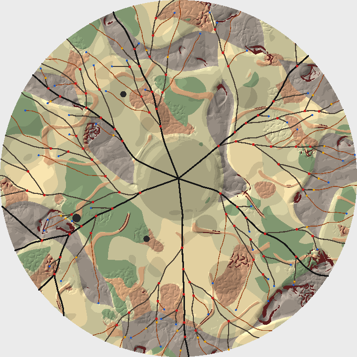
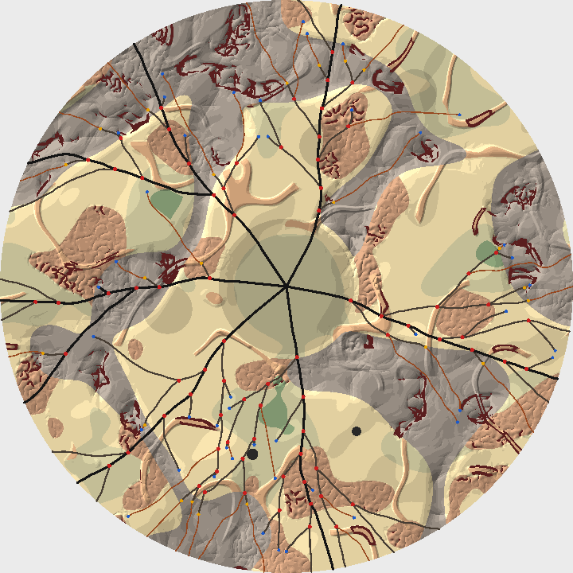

# Road growth (DDB-290)

Date: 2026-10-08. Code: `src/renderer/game/map/` (`Highways.ts`, `RoadGrowth.ts`, `RoadNetwork.ts`, `SegmentIndex.ts`, `Geometry.ts`, `RoadChecks.ts`), timed, swept, and drawn by `scripts/road-growth.mjs`. Spec: [Area Map Generation](../specs/Area%20Map%20Generation.md), Pipeline, 2 to 4. Follows [compound-and-area-map.md](./compound-and-area-map.md) (decision 2), [terrain-fields.md](./terrain-fields.md), and [seeded-prng.md](./seeded-prng.md).

## Context

Stages 2 to 4 lay the drivable network: highways out of the metro, then roads grown outward from them a step at a time, branching into back roads and trails. The spec gave the step rules and the shape, trees and never a web, and left the numbers open: how a step is scored, when and where a road branches, when a back road gives out to a trail, what clearance means where two roads meet, and what the network looks like as data. Growth owns three guarantees outright, 2 (outward), 3 (no crossings, and clearance), and 8 (branches leave at 20 degrees or more), and every later stage builds on what it returns. POIs attach to it and grow their approaches by its rules, tiers and routes walk its links, and the save keeps it.

Every value here is a starting value for the Map Lab (DDB-299) to tune. Two maps they grow, at radius 1000, drawn by `scripts/road-growth.mjs png`: highways black, back roads dark brown, trails rust, junctions red, dead ends blue, and class changes amber, over the terrain with its cliffs dark red and craters black.

## Two stages, two streams

`planHighways({ terrain, params, rng })` is stage 2, on the `highways` stream, and `growRoads({ terrain, params, highways, rng })` is stages 3 and 4, on `growth`. The spec names both streams; keeping them apart means a retry of growth never moves a bearing. Stage 2 forks `bearings`, and `drift` at each highway's index, so one more highway never moves another's drift. Growth forks `road` and `drift` at each road's id. A road's noise and branch draws come off its own stream: five numbers a step, one per candidate whether it survives or not, and four more whenever the road could branch, whether it does or not.

## What growth returns

Plain data, as the save keeps it. `RoadNetwork` is nodes, stretches, and roads, and JSON round-trips it.

- A node is where something happens on a road: the compound (node 0), where a highway leaves the metro, a junction, a class change, a dead end, or an exit at the rim.
- A stretch is road between two nodes, of one class: the unit stops, knowledge, and travel time count in. It holds its polyline as flat x, y pairs, its class, its two nodes, and `parent`, the stretch it leads on from toward the compound. A route is the walk up `parent` from an attach point. It ends at a highway's city street, every highway's first stretch, which runs straight from the compound to the metro's edge.
- A road is growth's lineage, a highway out of the metro or a branch from its junction to its end, as a chain of stretches, with the road it branched from. A back road that degrades stays one road whose later stretches are trails.

`RoadChecks.checkRoadNetwork` reads only this data, so the map validator can check a loaded map the way it checks a fresh one.

## Geometry without trigonometry

Generation branches on plain arithmetic so a seed grows the same roads in every engine (seeded-prng.md). Headings are unit vectors. `unitVector` turns degrees into one by Taylor series after reducing the angle to within 45 degrees of a quarter turn, under 1e-16 from the true values, and angles are compared by their cosines. Square roots are fine: ECMAScript specifies `Math.sqrt` as the correctly rounded root, while `hypot`, `atan2`, and the rest are only approximated, so none of those is used. Node 24's V8 and Electron 25's grow the bench's 45 networks to the same SHA-256, which the bench prints.

## Departures

Bearings start from even spacing with a random rotation, and each is jittered by up to a third of the gap. A set that breaks `highwaySeparation` is drawn again, up to 16 times, and if none fits, the last is scaled down until its tightest gap does, which even spacing always manages because the validator keeps `highways` times the separation within 360. Redrawing keeps the spread honest where the separation leaves room; scaling alone would pull nearly two maps in five toward even spacing, since at the defaults (6 highways, 35 degrees) about three first draws in five fit.

Each highway's preferred heading drifts from its bearing through knots 200 units apart, eased with a smoothstep, each uniform within the highway class's 45 degrees times `curviness`: 22.5 either way at the default and none at 0. The first knot is 0, so a highway leaves the metro on its bearing. There are knots enough for the longest a highway can grow, since every unit of road gains at least cos 65 degrees of one in distance from the compound.

## The step

Five candidate headings, evenly across the class's turn limit either way. The spec's limits (10, 18, and 28 degrees) are curviness 0.5's, and `curviness` scales them from 0.6 times at 0 to 1.4 times at 1, since even a ruler-straight road has to bend round a crater.

The cheap rules go first: outward, the junction angle on a parent's first step after a branch, and a travel cost sample at the step's end, which is Infinity on impassable ground. The survivors are scored, lowest best:

| Term | Weight | What it reads |
| --- | --- | --- |
| Travel cost at the step's end | 1 | `travelCost`, 1 on flat scrub |
| Travel cost 2.5 steps on | 0.5 | impassable ground counts as 8, off the map as 1 |
| Straying from the preferred heading | 12 highway, 6 back road, 3 trail | 1 - cos of the angle off it |
| Rough country and craters ahead | 4, 1.5, 0.3 | 10 lattice lookups 16 units apart, the nearest weighted most |
| Impassable ground ahead, highways only | 6 | the share of 80 units clear, sampled every 4 |
| Crowding by kin | 2 | how far into the band past the gap the clearance rule needs |
| Noise | 0.15 | one draw a candidate |

Then, best first, clearance against the spatial hash, and passability: craters exactly, as circles, and `impassable` every half unit, under the width of the terrain's thinnest cliff slivers. The first candidate to pass is the step. Leaving these two for last, and checking them lazily, means a step usually pays for one candidate's worth, since the best usually passes.

A candidate that would leave the disc is cut short at the rim, a hair inside so rounding can't put it outside, and the road ends there as an exit. A road ends as a dead end when nothing survives, and when it reaches its class's longest: 800 units for a back road, 400 for a trail, counted from where it took the class. Highways have no limit.

The outward rule is checked end to end: the gain must be at least cos 65 degrees of the step's length, which for a full step is the spec's s cos 65. Stated that way it holds for every segment the network ends up with, cut short at the rim or smoothed, so the checks test one rule everywhere.

## Clearance where roads meet

The spec's clearance can't hold where two roads meet, since at the junction they're zero apart. So two roads that share a junction, a branch and its parent at the branch's, or two highways at the compound, need only a tapered gap near it: `JUNCTION_TAPER`, 0.25, times the farther segment's distance from the junction, up to `roadClearance`. They may touch only at the junction itself, both segments ending exactly on it and leaving it at 20 degrees or more. The taper is under sin 20 degrees (0.342), so a branch at the least angle clears it, and so do highways the least separation apart, near the metro. That's why no validator clamp was needed for the case DDB-287 flagged, a small metro with tight separation and wide clearance: highways the least separation apart diverge faster than the taper asks wherever they are, and the property tests' first corner (radius 600, metro 0.08, 9 highways 20 degrees apart, clearance 60) keeps every rule. A road's own segments never count: the outward rule makes distance from the compound rise all along every road, so a road can't come back to itself.

The rule is stated per pair of segments, so growth and the checker apply it exactly and agree. Two simpler rules fall short. Waiving clearance near a junction altogether, and checking only for crossings, would let a branch run beside its parent a unit away until the waiver ran out, then stop: a doubled road ending in a stub. Measuring kin's gap from a step's end point alone would be cheaper but lets the middle of a step pass closer than its end.

## Keeping the highways going

When the bench first counted them, 22% to 42% of highways reached the rim, fewest on the largest maps. Zoomed renders showed three causes:

- A highway's drift turned it back into its own branch, and the taper then blocked every candidate. Kin crowding scores how near a candidate comes to the gap the rule needs from a road it meets: 1 at that gap, easing to 0 at 1.75 times it. A road and its branch turn apart before the rule stops either.
- A branch of a neighbouring highway's branch swept across a highway's path before the highway got there. The queue orders tips by distance from the compound, and a road heading tangentially outruns one heading straight out. Highways now count 100 units nearer than they are, so the trunks claim their way first.
- Cliff bands across the whole fan. One cost sample ahead rarely lands on a band a few units wide. The rough-country ray, lattice lookups out to 160 units, steers every class round islands of cliff country, and highways look for impassable ground itself 80 units ahead.

Now 76% to 87% of highways reach the rim (table below). The rest end in rough country.

Crowding by every road, kin or not, was tried and dropped: roads settled alongside each other at the band's edge and combed the map with parallel lines. Instead, a back road or trail whose best candidate runs into the clearance of a road it doesn't meet ends there. That reads as a road that gave out, and dead ends are what POIs attach to. A highway turns aside instead, as the rules let it.

## Branching

A road can branch once it's 4 steps past its last junction. Each step after that it draws a number, the branch angle (uniform, 20 to 55 degrees), the branch's class, and a tie-break, and branches when the number falls under

    class chance x branchiness scale x distance ramp x room^2

- Class chance: highway 0.4, back road 0.35, trail 0.
- `branchiness` scales it from 0.3 times at 0 to 1.7 times at 1.
- The ramp is half the chance at the metro's edge and all of it from 0.4 of the radius out, with no branch at all within 6% of the rim, where it would only be a spur off the map.
- Room is open room on the roomier side, 0 to 1: the distance to the nearest other road at three points 40 units apart along the branch's heading, each counting up to 120 units (or 3 clearances, if that's more), stopping at the rim or on impassable ground. The branch goes to that side.

A per-step chance alone left whole quadrants empty on some maps and combed others with parallel branches. Scaled by the room's square, branches fill empty country and leave crowded country be, and `branchiness` sets how densely. Room counts in world units rather than clearances so that `roadClearance` stays a gap and not a density: counted in clearances, clearance 10 with branchiness near 1 grew 125,000 units of road at radius 1600.

A branch has to take its first two steps at once, the first straight along its junction angle, or it isn't made, so no branch is a stub. The parent's next step keeps 20 degrees from it. A highway's branch is a back road, or a highway 6% of the time (an interchange); a back road's is a trail 40% of the time and otherwise a back road; trails don't branch.

## Class change

A back road keeps a running mean of its steps' travel cost, each step weighing half, and becomes a trail from its tip on once the mean passes a threshold that falls from 3.2 at `trailShare` 0 to 1.7 at 1. Flat scrub costs 1 and mountains 2.5 before slope, so at the default threshold (2.45) back roads give out in mountains and on steep badlands, and at 1 in mire and any badlands too. A mean rather than one step's cost keeps a single costly step, across a canyon say, from degrading the rest of the road.

## Smoothing

Chaikin, two passes, stretch by stretch with the nodes held still. Each end segment keeps its direction, so junction angles and the turns at nodes survive, and inside a stretch Chaikin only shares turns out. A smoothed stretch has to keep every step rule against everything laid so far, the stretches smoothed before it included, so the final geometry keeps them pair by pair; one that fails keeps its steps. Over the bench's 30 maps at radius 800 and 1200, 53 of 5,866 stretches (0.9%) did.

## The water seam

Water is impassable through `impassable` like the rest, once the water stage (DDB-289) adds it with `withWater`, and growth samples every half unit everywhere, not just in rough cells, so a thin river can't slip between samples. The bridge rule, a river crossed square-on, needs rivers told from lakes and a river's direction, which `WaterLayer` doesn't give yet. `isPassable` is where it goes in: samples on a river the step crosses within some angle of square stop counting, and the crossing is recorded as a bridge. The network has no bridges until then.

## Tests

- A test per step rule: outward, either side of 65 degrees and measured end to end; passable, a crater grazed between samples and a sliver a little wider than the spacing; clearance, a stranger at the clearance, kin at the taper, touching at a junction at 25 and 15 degrees, highways at the compound; the disc; the candidate turns; scoring by cost and by drift; noise; exits; dead ends; the roomier side; branch classes; degradation and its threshold; class lengths; branch angles; smoothing; plain data; water; and the queue's order.
- Property tests over parameter sets sampled across the world and network tuning ranges, corners first: `checkRoadNetwork` finds nothing (passable, outward, disc, crossings, clearance, junction angles, and the trees), every bend is within its class's turn limit, every branch leaves 20 to 55 degrees from its parent's way in, every parent chain reaches a highway root without a loop, the highways are the departures, and growing again gives the same network while the next seed gives another. CI grows 24 maps, `ROAD_PROPERTY_MAPS` sets more, and `scripts/road-growth.mjs check` runs the checks alone outside Jest: none failed in 1,000 maps.
- `checkRoadNetwork` has tests of its own: a valid network passes, and each kind of break is found.

## Performance

Measured with `scripts/road-growth.mjs bench` on a Ryzen 9 5950X that other work was sharing at 25% to 40% load, so each map's figure is the fastest of five runs. Stages 2 and 3 together, the median and the slowest over the five environments and three seeds each:

| Radius | Node 24 (V8 13.6) | Electron 25 (V8 11.4) | Steps | Stretches | Road | Highways reaching the rim |
| --- | --- | --- | --- | --- | --- | --- |
| 600 | 7.7 ms (9.7) | 8.2 ms (10.5) | 540 | 85 | 11,200 units | 81% |
| 800 | 13.7 ms (17.7) | | 939 | 139 | 19,100 | 86% |
| 1000 | 20.8 ms (28.6) | 21.8 ms (30.3) | 1,381 | 202 | 28,100 | 87% |
| 1200 | 29.0 ms (41.9) | | 1,942 | 270 | 39,500 | 81% |
| 1600 | 52.9 ms (73.0) | 56.4 ms (75.5) | 3,401 | 428 | 68,900 | 76% |

About 15 us a step, most of it terrain: two `travelCost` samples a candidate, about 600 ns each (terrain-fields.md), and the half-unit passability samples for the candidates checked, cheap outside rough cells. Steps follow the network's length, so the area and `branchiness`: the densest corner of the tuning ranges, radius 1600 with branchiness 1, takes about 5,500 steps and 95 ms here. Campaign maps (radius 800 to 1200, branchiness 0.3 to 0.7) take 14 to 30 ms, which leaves most of the 200 ms to the stages after. Nothing is allocated per candidate; the only allocation in a step is its point and segment joining arrays that double as they fill. `checkRoadNetwork` takes a median of 6 ms over sampled maps, 36 ms at the densest, which the map validator will spend once a map.

## Consequences

- Stage 5's approaches can grow by `StepRules` with outward relaxed to "no closer than where it attached", a heading toward the POI, and clearance waived at the POI. Registering an approach as a branch of the road it attaches to gives it the junction taper at its attach point.
- The map validator can run `checkRoadNetwork` as it is for guarantees 2, 3, and 8.
- About one highway in five ends in rough country short of the rim. Strongholds need roads near the outer band in every sector; if stage 5 comes up short there, the stage retry (Validation and retries) or a longer wall lookahead are the levers.
- `GrowthStats` (steps, rejections by rule, how roads ended, branches tried and grown, degradations, smoothing) is for the Map Lab's readout and for tuning.
- No new parameter was needed. If the Map Lab wants one, the room cap is the candidate: how far apart branches settle, which is density at a given branchiness.
- A change to any value here moves every map, so it ships with a generator version bump (DDB-296).
