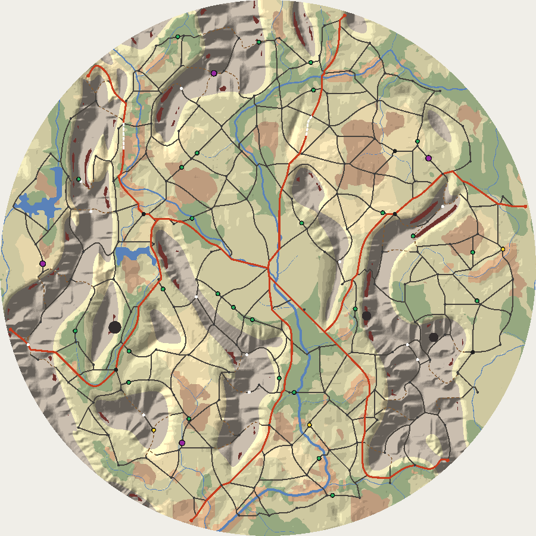
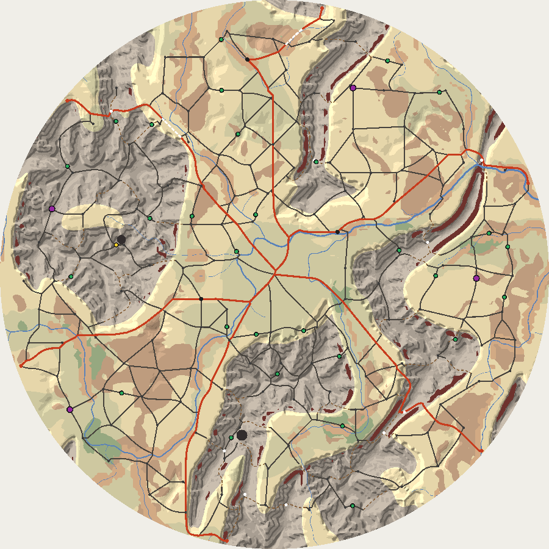

# The road network: links and the graph (DDB-443, DDB-444)

Date: 2026-10-10. Code: `src/renderer/game/map/` (`RoadCost.ts`, the edge cost field; `RoadLinks.ts`, the links; `RoadGraph.ts`, the graph; `Roads.ts`, the stage, broken highways, and the stand-in places; `RoadChecks.ts`; `RoadNetwork.ts`, the plain data), wired in `AreaMapPipeline.ts`, timed, swept, and drawn by `scripts/road-network.mjs`. Spec: [Area Map Generation](../specs/Area%20Map%20Generation.md), 5. Roads, Guarantees 3, Validation and retries, and Performance. Builds Maps 7 and 8 of [realistic-map.md](./realistic-map.md), decision 2, over the land and water of [water-and-biomes.md](./water-and-biomes.md), and replaces road-growth.md's outward growth, whose `Highways.ts`, `RoadGrowth.ts`, step rules, tests, and script are gone.

## Context

The spec's roads are least-cost links between places with a detour test for loops (Galin et al.), and the prototype showed the shape: 36,000 to 47,000 units of road at radius 1000, 450 to 600 nodes, 110 to 190 loops. The route tree and POIs (route-tree-and-pois.md) were built against synthetic meshes and waited on a real network with loops, so this is what turns their strict mode on. Map 5 left four notes for it: hold both ends of a bridge step when smoothing, find bridges over the whole polyline, use a per-map edge cost field rather than `moveCost` in the search's inner loop, and test that field against `moveCost`.

Two maps at radius 1000, drawn by `scripts/road-network.mjs png` with the stand-in places: highways red, back roads grey, trails dashed brown, broken highway spans dashed white, towns and exits as large dots, crossroads small, passes white, and POIs green (three routes yellow, strongholds purple).

## The stage

`roads` runs after water on `root.fork('map', m).fork('terrain', t).fork('water', w).fork('roads', r)`, and draws only on named forks: `spur` at each village's id, `broken`, and, for the stand-in places, `exits` and `crossroads`. Its product is `{ network, stats }`. It fails, and reruns on its next attempt, when a place has no road, when the network closes fewer loops than `poiDensity` times 30 plus `strongholds` (rounded up), or on any of `checkRoadNetwork`'s rules. The POI stage escalates to it.

## The edge cost field

A move runs between two land cell centres: the eight to a neighbour, and four bridges two cells straight on (below). Each keeps the parts of its cost no class changes: its length, the grade along it, the slope across at its middle, its bridges' length factors summed, and whether it's blocked. A class weights them as `moveCost` does, so the two agree on every move the field leaves open, to 1e-12 (the test checks a fifth of a map's cells, every move, every class).

The field is stricter in two ways. A cell centre has to be open, inside the disc by half a unit and on passable ground, at both ends of a move; `moveCost` reads only the end. And a move through a square between cell centres where anything impassable could stand is sampled every half unit, blocked where a sample is impassable bar river water under one of its bridges. A square's flags say what could stand there and so what to sample for: a cliff only where a corner is rough country (bilinear can't pass its corners), a lake only where a corner's depth is past -0.001, a river where its water and a unit more reach, a crater likewise, and anything beside a cell that isn't open. Asking only after what could be there, in `obstacle`'s own terms (`Terrain.cliff` is new for it), took about a quarter off the stage's time.

A move is worked out the first time a search asks, and kept: about 140,000 of a radius 1000 map's 393,000 are. Every part is adds, multiplies, divides, square roots, and compares, so the order searches fill it in changes nothing, which a test checks.

A broad river can leave no dry cell centre either side close enough for one step: a 9-unit river crossed square-on needs centres 9.4 apart to straddle it within 0.2 of the middle. So a road may also bridge two cells straight on, east, north, west, or south, but only over a cell whose centre is in a river, never a lake, cliff, or crater, and always sampled. They're what joins the far shore of a broad river.

## Searches

A* over the field, ties to the lower cell, bounded to an ellipse whose foci are the two places and whose distances to them sum to 1.7 times their span plus three cells; a search that finds nothing tries again 2.5 times wider. The heuristic is the straight distance at existing road's cost, 0.75 a unit (0.7 for a highway on highway), so it never overestimates. A heuristic at full cost cut expansions by a fifth and was left out, since it would miss paths that reuse road.

- Existing road costs 0.75 of the move, existing highway 0.7 to a highway, so roads merge into trunks. A cell beside a road costs 1.6 times, so a road joins another or keeps a cell clear of it.
- A move never crosses the other diagonal of its square, a road's or the search's own last two moves (a zigzag round a blocked side made one), never closes a triangle with two road moves, and a bridge two cells long never crosses another over the same cell. So two paths that cross share a cell, and the graph makes it a junction.

## Highways and back roads

Highways go first, exit by exit: to the first town in the list (best ground first) within 24 degrees of the exit's bearing and a quarter to nine tenths of the radius out, then to the compound, or straight to the compound when there's none, which a range-covered map can have.

Back roads take the Gabriel graph over every place, exits never with exits, under 0.45 of the radius, shortest first, ties by id, through grid buckets so it costs a few milliseconds. A link between places not yet joined always goes in, as a back road or, past a grade a back road can't climb, a trail. Otherwise it goes in only where the roads between its places run longer than the detour factor times its own path: 1.9 at `loops` 0 to 1.1 at 1. The roads between are a Dijkstra over road moves bounded by the factor; when it finds them within the factor of the straight span, the link is skipped without a search, since its path can't be shorter than that. Places a link still leaves cut off join the nearest road the compound reaches, by Dijkstra.

## Classes, spurs, passes

A back road gives out to a trail along a run of moves through rough country (`Terrain.rough`, the steepest 10% to 35% of the land) at least 150 units long at `trailShare` 0 to 15 at 1, 82 at the default. A move keeps the best class laid along it. Trails come to 8% or 9% of the road at the defaults.

A village takes a spur trail with chance 0.55, drawn on its own fork: toward the highest open cell 60 to 140 units off at 16 bearings, turned by a draw, 0.12 of elevation above it or more, if the trail runs 200 units or less. It ends at a dead end. The stand-in places have no villages, so spurs wait for Map 6.

A path's highest cell is a pass where the ranges' mask is 0.5 or more there and it stands 0.05 above both ends, 30 units from any other: 11 a map at radius 1000.

## The graph

The road moves become nodes and stretches:

- Node 0 is the compound at the origin, standing on the four cells round it. Each cell keeps at most one move into them, its best class, so each of the compound's roads leaves once, along a ray to a cell 1.6 to 2.1 cells out. No two rays from the origin overlap.
- Every other node stands on a cell centre: a place's (each place stands on its own cell or the nearest open neighbour), a junction (three or more moves), a dead end, the last cell inside the metro on a road leaving it, and a class change. So no two nodes are closer than a cell, and no merging is needed. A diagonal closing a triangle with two orthogonal road moves is dropped first, handing its class on.
- Each road between two nodes is walked once. A loop back to its own node is split at its middle.
- A stretch's line is its cells, held still at its nodes and at both ends of every bridge move. Between holds, two passes of a quarter, half, quarter average take out steps back and forth between two rows (which simplifying keeps), then Douglas-Peucker at 0.6 of a cell, then two passes of Chaikin. One that would be impassable, sampled every half unit with its bridges over the whole line, or that would clash with another, falls back to the line simplified and smoothed without the averaging, then to its cells, which the field proved. Almost every stretch stays smoothed: on Mixed seed 7 at radius 1000, all but ten of 567.
- Stretches over 140 units are cut into even pieces at roadside nodes, on a point within a unit of the share or a point put on the segment there, moved off any bridge to the nearer end of its deck.
- A stretch keeps its class, length, polyline, bridges (each deck as distances along its line, merged where two crossings share one), and whether it's a city street, wholly inside the metro, charted from the start. A stretch no longer has `parent`, and the network no longer has `roads`: the route tree holds parents, and named roads for labels are the dressing's.

## Broken highways

Highway stretches 70 units or longer whose middle lies past 0.35 of the radius, in an order shuffled on `broken`, each taken out only where every node still reaches the compound. They move to `network.broken`, kept for drawing with their gap.

## The checks

`checkRoadNetwork` reads only the network and the land: structure (node 0 at the origin, each stretch between two different nodes and starting and ending on them, its length, its bridges in order), the disc, passability every half unit with the stretch's own bridges, the bridges matching what the line crosses, planarity and clearance by a sweep over every pair of segments in 16-unit buckets, and every node reaching the compound. Two stretches keep 2 units apart, tapering by a quarter of the distance to a node they share, and meet only at a node both end on, 20 degrees apart or more. Over 15 maps the checks take 10 ms at radius 1000. Outward, junction angles from a parent, and the tree are gone with growth.

A bridge longer than the longest has no deck, so its water fails passability; a length check on decks was dropped, since two crossings sharing a deck can run 32 units together.

## Stand-in places

Until the places stage (Map 6, DDB-442) lands, `standInPlaces` gives the roads the compound, the terrain's towns, crossroads thrown over open ground `roadDensity` apart (140 units at 0 to 70 at 1) and three quarters of that from towns and exits, and the highway exits at 0.985 of the radius, evenly round from a drawn turn, each slid up to 8 degrees to ground a side-to-side flood fill from the compound reaches past lakes, cliffs, and craters with rivers crossed. An eight-way fill leaked past a lake's corner and left an exit cut off. It goes when Map 6's `Places` are read instead.

## Measured

`node scripts/road-network.mjs bench --radii 1000,1200`: five environments by three seeds, the whole pipeline, strict POIs, on the shared development desktop (Node 24), busy with other work:

| Radius | Roads, ms median (slowest) | Terrain | Water | Nodes | Stretches | Road, units | Loops (least) | Bridges | POIs placed | Three-route POIs | Retries |
| --- | --- | --- | --- | --- | --- | --- | --- | --- | --- | --- | --- |
| 1000 | 279 (355) | 345 | 44 | 458 | 610 | 43,408 | 163 (120) | 63 | 450 of 450, 60 strongholds | 52 | 0 of 15 |
| 1200 | 416 (458) | 533 | 60 | 635 | 855 | 61,450 | 221 (177) | 93 | 450 of 450, 60 strongholds | 54 | 0 of 15 |

The roads' time at radius 1000, profiled over six maps: A* about 50 ms, the field's moves about 90 (their samples, the grade, the slope, and river crossings), the graph about 40, the network checks 10, the stand-in places about 20. The prototype's roads took 140 to 210 ms; the spec's grid stages budget a second on a mid-range laptop, and terrain, water, and roads come to about 670 ms here at radius 1000 and a second at 1200. The levers, should a laptop need them, are in the follow-ups: the obstacle samples and the per-class cost.

`check --maps 30`, parameters sampled across their tuning ranges: every stage's first attempt passed on 27 or more of 28, none broke a road rule, and two maps gave up, both radius 600 to 644 with `poiDensity` near 2, five to seven strongholds, and `roadDensity` 0: they need 64 or 65 loops and their stand-in places close 30 to 35. That corner of the tuning ranges can't hold the POIs it asks for, whatever the roads do (a follow-up).

## Determinism

The tests pin two maps' networks as hashes of every node and stretch point, computed in a separate Node process from the Jest run that checks them, and check that the same stream makes the same network and another stream another.

## Consequences

- `RoadNetwork` is `{ nodes, stretches, broken, passes }`; a node has an optional `place`, and a stretch `length`, `bridges`, and `street`, without `road` or `parent`. The worker packs stretches' points as before and sends broken spans and passes by structured clone.
- The area map view draws an uncharted stretch as a stub when a charted or rumored stretch ends on the node it starts from, and a junction dot where any stretch there is drawn solid, since there are no parents to ask. Knowledge per leg is DDB-294's.
- The POI stage is strict (route-tree-and-pois.md), and the gallery's area map scenes move with every road.
- A change to any number here moves every map, so it goes with a generator version bump.

## Provisional calls

Calls the spec and realistic-map.md left to the build, made the simplest way consistent with them, for Kevin to approve or adjust:

1. Moves between land cell centres, eight ways, plus a bridge two cells straight on over a cell whose centre is in a river.
2. Cell centres half a unit inside the rim; a move through a square where anything impassable could stand sampled every half unit.
3. Searches bounded to an ellipse 1.7 times a link's span plus three cells, widened 2.5 times when that finds nothing; an admissible heuristic at existing road's cost.
4. Existing road at 0.75 of new ground, existing highway at 0.7 to a highway, ground beside a road at 1.6 (realistic-map.md's 13, with the highway's own).
5. Highways through the first town in the list within 24 degrees of the exit's bearing, a quarter to nine tenths of the radius out.
6. Gabriel links under 0.45 of the radius, the test's circle 0.92 of the diametral one's area, exits never linked to exits.
7. The detour factor 1.9 at `loops` 0 to 1.1 at 1 (realistic-map.md's 13); links within it of their straight span skipped unsearched.
8. A back road becomes a trail along a run through rough country 150 units long at `trailShare` 0 to 15 at 1.
9. Spurs: chance 0.55 a village, the highest open cell 60 to 140 units off at 16 bearings, 0.12 of elevation up, at most 200 units of trail.
10. Passes: a path's highest cell in the ranges (mask 0.5), 0.05 above both ends, 30 units apart.
11. Geometry: two quarter-half-quarter passes, Douglas-Peucker at 0.6 of a cell, two Chaikin passes, falling back to unaveraged, then cells.
12. Stretches cut at 140 units; clearance 2 units, tapering by a quarter toward a shared node; stretches meet at nodes 20 degrees apart or more.
13. The compound stands on its four cells, with one move into them from each cell.
14. Broken highways: stretches 70 units or longer with their middle past 0.35 of the radius.
15. The roads stage fails below `poiDensity` times 30 plus `strongholds` loops, rounded up.
