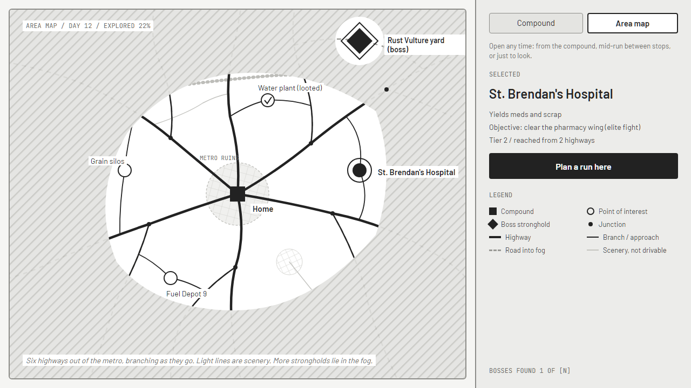
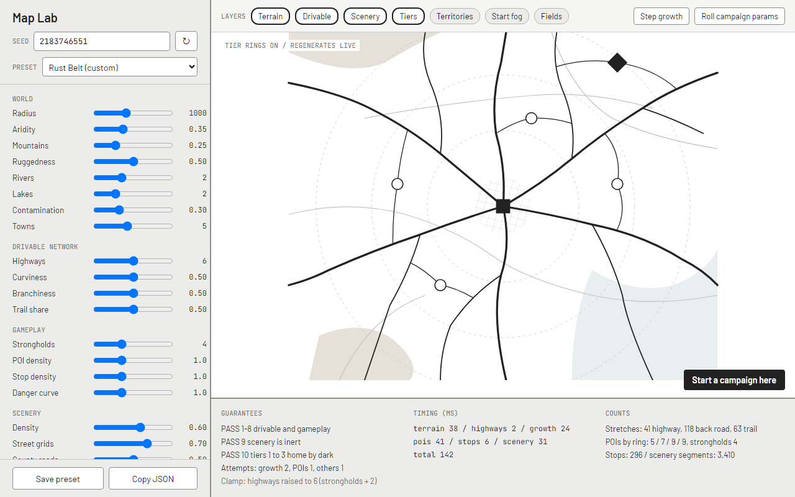

# Area Map Generation

Status: designed 2026-10-06, not built. Gameplay it serves: [Compound and Supply Runs](./Compound%20and%20Supply%20Runs.md). Decision record: [compound-and-area-map.md](../AI_TECHNICAL_DECISIONS/compound-and-area-map.md).

The area map is generated once, when a campaign founds its compound, from a seed and a set of map parameters. Everything after that (fog lifting, roads charted, stops cleared and coming back) is state layered over the generated map, never a regeneration.

The shape to aim for: the compound sits in the ruins of a metro area, and the region's drivable roads are the highways leading out of it. They leave at irregular angles, bend with the terrain, and branch as they go, highways forking into back roads and back roads thinning into trails. It's a set of trees growing outward from one root, not a web. Points of interest are destinations at the ends of those roads; no drivable road runs through one and on to another.

## Two layers: drivable roads and scenery

A region with only the drivable network would look empty and fake. Real country is full of roads: town grids, county roads, rail lines, highways that used to go somewhere. So the map has two layers, generated in that order.

- Drivable network: the roads runs can use. Everything in Gameplay rules applies to it: outward growth, no crossings, routes, stops, fog knowledge, tiers. It's generated first, from the terrain alone.
- Scenery: roads and lines that make the region look real and carry no gameplay at all. No stops, no routes, no knowledge state, not selectable. They follow their own looser rules, can cross drivable roads and each other, and are generated last, from their own random stream, so tuning scenery can never move a drivable road or a stop.

In fiction the scenery roads are what nobody drives any more: collapsed, mined, choked with wrecks, or just not worth the fuel. The drivable network is the roads people still use.

## Guarantees

Hard guarantees hold for every map the generator returns, for any parameters inside their tuning ranges. The validator checks each one, and a map that fails is regenerated (see Validation and retries).

1. Deterministic: the same seed, parameters, and generator version produce the same map.
2. Outward only: every drivable road runs away from the compound for its whole length.
3. No drivable crossings: no two drivable roads cross or touch except at a junction they share, in the drawn geometry, and each keeps a minimum clearance from drivable roads it doesn't meet.
4. Destinations, not waypoints: every POI and stronghold is a dead end of the drivable network. There's no driving from one objective to another.
5. Real choices: every POI has at least two routes from the compound, and any two routes to a POI share nothing outside tier 1. They may leave the compound on the same highway, but they split before leaving the home area.
6. Strongholds all around: one per sector, sectors evenly spaced around the compound with a random rotation, each stronghold in the outer band and outside the starting reveal by at least one tier.
7. A survivable start: inside the starting reveal there's at least one POI yielding each of food, water, and fuel, and at least one Find: driver stop within tiers 1 and 2.
8. Readable: drivable branches leave their parent at 20 degrees or more, and labels have room.
9. Scenery is inert: removing every scenery road changes no gameplay data. Scenery never reaches a POI, never forms a junction near a drivable junction or stop, and is always drawn lighter and thinner than the lightest drivable class.
10. Home by dark early on: every POI in tiers 1 to 3 has at least one route whose estimated run (drive out, stops, objective, drive home) fits in `daylightHours`. Tiers 4 and 5 may not; runs into the night are a late-game mechanic.

Soft goals are scored, not required: three routes rather than two for most POIs, routes to a POI that differ in road class and length, biome variety, and faction territories of similar size.

## Map parameters

All generation reads one `MapParams` object: the seed plus a set of tunable characteristics. During the prototype every parameter is a control in the Map Lab (below). In the finished game the parameters are rolled from the seed along with everything else.

Each parameter has a tuning range (what the Map Lab allows, and what the guarantees must survive), a default, and a campaign range (what the finished game rolls from, usually narrower; balance knobs like `routesTarget` and `driverFinds` hold one value). Values below are starting points for the Map Lab to settle.

### World

| Parameter | Tuning range | Default | Campaign | What it does |
| --- | --- | --- | --- | --- |
| `seed` | any uint32 | random | the campaign's | every random stream |
| `environment` | High Desert, Rust Belt, Floodlands, Badlands, Mixed | Mixed | any | a preset that sets the defaults of the parameters below it; any can still be overridden (see Environments) |
| `radius` | 600 to 1600 | 1000 | 800 to 1200 | world units; map size, and with it campaign length |
| `aridity` | 0 to 1 | 0.5 | 0.1 to 0.9 | dry desert to wet ground and mire |
| `mountainCoverage` | 0 to 1 | 0.25 | 0.05 to 0.45 | share of land that's high and rough |
| `ruggedness` | 0 to 1 | 0.5 | 0.15 to 0.85 | how sharp mountains are: rolling hills to cliffs and narrow passes |
| `rivers` | 0 to 6 | 2 | 0 to 5 | river count; drivable roads cross only at bridges |
| `riverMeander` | 0 to 1 | 0.5 | 0.2 to 0.8 | straight channels to looping ones |
| `lakes` | 0 to 8 | 2 | 0 to 6 | standing water, impassable |
| `contamination` | 0 to 1 | 0.3 | 0.1 to 0.7 | how much of the map is toxic; feeds mire and hazards |
| `hotspots` | 0 to 6 | 3 | 1 to 5 | blast sites and spills: craters and strong contamination |
| `metroSize` | 0.08 to 0.25 | 0.15 | 0.12 to 0.2 | metro ruins radius as a share of `radius` |
| `towns` | 0 to 12 | 5 | 2 to 9 | ruined towns outside the metro; raise POI density |

### Drivable network

| Parameter | Tuning range | Default | Campaign | What it does |
| --- | --- | --- | --- | --- |
| `highways` | 3 to 9 | 6 | 5 to 7 | highways leaving the metro |
| `highwaySeparation` | 20 to 60 degrees | 35 | 25 to 45 | minimum angle between departures |
| `curviness` | 0 to 1 | 0.5 | 0.25 to 0.75 | scales turn limits and heading drift: ruler-straight to winding |
| `branchiness` | 0 to 1 | 0.5 | 0.3 to 0.7 | how often roads fork, and how far out the trees fan |
| `trailShare` | 0 to 1 | 0.5 | 0.25 to 0.75 | how readily roads degrade to trails in rough ground |
| `roadClearance` | 10 to 60 | 24 | 20 to 28 | minimum gap between drivable roads |

### Gameplay

| Parameter | Tuning range | Default | Campaign | What it does |
| --- | --- | --- | --- | --- |
| `strongholds` | 2 to 8 | 4 | 3 to 5 | strongholds, one per sector |
| `poiDensity` | 0.5 to 2 | 1 | 0.8 to 1.2 | multiplies the POI target per ring (5, 7, 9, 9 at 1) |
| `routesTarget` | 2 or 3 | 3 | 3 | approaches to aim for per POI (2 is always required) |
| `startingReveal` | 1 to 2 tiers | 1 | 1 | how much starts charted |
| `stopDensity` | 0.5 to 2 | 1 | 0.8 to 1.2 | multiplies stop counts per road |
| `dangerCurve` | 0.5 to 2 | 1 | 0.9 to 1.1 | how fast encounters scale with tier |
| `driverFinds` | 1 to 4 | 2 | 2 | Find: driver floor within tiers 1 and 2 |
| `daylightHours` | 10 to 16 | 14 | 13 to 15 | dawn to dark; how long a run has before night |
| `travelPace` | 0.5 to 2 | 1 | 0.9 to 1.1 | multiplies hours per unit of road for every class |
| `stopTables` | JSON | shipped tables | shipped tables | stop type weights per class, biome, tier, and territory |

### Scenery

| Parameter | Tuning range | Default | Campaign | What it does |
| --- | --- | --- | --- | --- |
| `sceneryDensity` | 0 to 1 | 0.6 | 0.4 to 0.8 | master scale for everything below |
| `streetGrids` | 0 to 1 | 0.7 | 0.5 to 0.9 | how built-up the metro and towns look |
| `countyRoads` | 0 to 1 | 0.5 | 0.2 to 0.7 | rural roads across the countryside |
| `brokenHighways` | 0 to 4 | 2 | 1 to 3 | pre-war highways that no longer go anywhere |
| `railLines` | 0 to 4 | 1 | 0 to 3 | rail lines crossing the region |
| `farmTracks` | 0 to 1 | 0.4 | 0.1 to 0.6 | short dirt tracks in scrub |

### Environments

`environment` sets the defaults of world, drivable network, and scenery parameters, never gameplay ones, so it changes the land and not the rules. A parameter it leaves alone keeps the default above, and Mixed leaves all of them alone: the defaults above are Mixed's. A value set explicitly, in the Map Lab or a preset, wins over the environment's, and the Map Lab shows which values are the environment's and which are overridden.

High Desert is dry tableland cut by canyons, with long straight roads and few towns. Rust Belt is old industry in rolling river country, dense with ruins, spills, rail, and paved roads. The Floodlands are low, wet, and flat, with looping rivers, standing water, and mire. The Badlands are broken, toxic ground where roads give out to trails. Starting values for the Map Lab to tune, blank where the environment keeps the default:

| Parameter | High Desert | Rust Belt | Floodlands | Badlands |
| --- | --- | --- | --- | --- |
| `aridity` | 0.15 | 0.55 | 0.85 | 0.3 |
| `mountainCoverage` | 0.35 | 0.15 | 0.05 | 0.35 |
| `ruggedness` | 0.65 | 0.35 | 0.25 | 0.8 |
| `rivers` | 1 | 3 | 5 | 1 |
| `riverMeander` | 0.3 | | 0.75 | |
| `lakes` | 0 | | 6 | 1 |
| `contamination` | 0.2 | 0.45 | 0.4 | 0.6 |
| `hotspots` | 2 | 4 | | 5 |
| `metroSize` | | 0.18 | | |
| `towns` | 3 | 8 | | 3 |
| `curviness` | 0.4 | | 0.6 | 0.65 |
| `branchiness` | 0.4 | 0.6 | | |
| `trailShare` | | 0.35 | | 0.7 |
| `streetGrids` | | 0.85 | | |
| `countyRoads` | 0.3 | 0.65 | | 0.25 |
| `brokenHighways` | | 3 | | |
| `railLines` | | 3 | | |
| `farmTracks` | 0.15 | | 0.5 | 0.1 |

### Randomising for the finished game

- `rollParams(seed)` draws every parameter from its campaign range on the `params` stream, environment first (an even pick) and the rest around that environment's defaults. Each parameter draws on its own fork of `params`, named by its key (`environment`, `radius`, and so on), so a parameter's roll depends only on the seed, its own range, and the environment: adding, removing, reordering, or retuning a parameter, or an option pinning one, never moves another parameter's roll.
- Each number is a triangular draw peaking at the environment's value and reaching at most half its campaign range to either side, never past the range, snapped to the parameter's step in the Map Lab. So each campaign range holds every environment's value and has each end within that reach of one of them, and a range no environment moves sits evenly round its default. Generation then runs on the rolled parameters with the same seed.
- Rolled parameters go through the parameter validator like any others. Campaign ranges leave room for its rules (`highways` 5 to 7 covers `strongholds` 3 to 5 plus 2, and 7 highways fit 45 degrees apart), so a rolled value never leaves its campaign range.
- Later, player-facing options (a difficulty, a region type) can pin some parameters and let the rest roll.
- The save stores the resolved parameters, not just the seed.

## Seeds and determinism

- A campaign has a 32-bit seed, shown in campaign history and enterable from the Map Lab.
- Generation uses a seeded PRNG, sfc32, in which every stream is rebuilt from a uint32 seed; the algorithm, the stream hash, and how many draws each call takes are in [seeded-prng.md](../AI_TECHNICAL_DECISIONS/seeded-prng.md). `Math.random` is never called during generation.
- Each stage draws from its own named stream, derived from the seed, the map attempt, the stage name, and the stage's attempt: `terrain`, `highways`, `growth`, `pois`, `stops`, `scenery`, `names`. The parameters roll from a `params` stream derived from the seed alone, and founding the campaign deals its starting pool from a `founding` stream of its own (Compound and Supply Runs, Founding the compound). Changing the stop tables never moves a road, retrying one stage doesn't disturb the ones before it, restarting the whole map never replays a stream that already failed, and nothing in the scenery stage can reach the drivable layer. A parameter change only moves what depends on it, though terrain changes still move the roads that steer by terrain.
- Game code, map and campaign included and tests too, never reads an unseeded source: lint rejects direct `Math.random` and crypto random calls (Web Crypto's and Node's) everywhere but `freshSeed()`, which mints root seeds, and anything reached through an import takes an `Rng`.
- `Math.sin`, `Math.exp`, and friends aren't guaranteed bit-identical across JS engines, so the same seed can differ slightly between V8 and another browser engine. That's acceptable because saves store the generated map (see Saving); only seed sharing across engines is affected. Decisions that branch on a value (thresholds, comparisons) should avoid sitting on transcendental results where a cheap alternative exists.

## World space

- The area is a disc of radius `radius` with the compound at the origin.
- Screens scale world space to fit. The area map shows the whole disc, cropped to what's been uncovered plus a margin; the run route screen crops to the compound, the POI, and its routes.

## Pipeline

Nine stages, in order. Each takes the previous stages' output and its own stream. Stages 1 to 8 make the gameplay map; stage 9 dresses it.

### 1. Terrain

- Sample continuous fields over the disc, each fractal noise from the `terrain` stream: elevation, moisture, and contamination. `environment`, `aridity`, `mountainCoverage`, `ruggedness`, `contamination`, and `hotspots` shape them; mountains are ridged noise masked by coverage, and ruggedness sharpens the ridges.
- Biomes come from thresholds on the fields: barren desert (dry), scrub (middling), toxic mire (wet, low, contaminated), badlands, canyons, and mountains (high and rough). These are the regions the lore already names.
- The metro: ruins stamped around the origin (`metroSize`), plus `towns` smaller ruined towns placed by Poisson-disc sampling further out. Ruins raise POI density nearby.
- Water: `rivers` traced downhill from high points to the edge, meandering by `riverMeander`, and `lakes` filled in low basins. Water is impassable except where a drivable road crosses a river at a bridge (a candidate spot for a "bridge out" hazard).
- Impassable mask: water, craters, and cliffs (steep elevation change). No drivable road or POI goes on it.
- Travel cost per point: a biome base cost plus a slope term. Road growth steers by it.
- Near the compound the fields blend toward scrub, so the start is never a swamp or a cliff.
- The noise is evaluated as functions, not a fixed grid, so later stages can sample at any resolution. The area map's terrain image is baked from these fields once.

### 2. Highways out of the metro

- Pick `highways` departure bearings. Not evenly spaced: start from even spacing with a random rotation, jitter each by up to a third of the gap, and keep `highwaySeparation`.
- Each highway starts at the edge of the metro on its bearing. The compound reaches each one through a short stretch of city street, which belongs to the highway and is charted from the start.
- Each highway also gets a preferred heading that drifts slowly along its length (low-frequency noise, amplitude from `curviness`), so it sweeps and bends instead of running due straight.

### 3. Growth

Drivable roads grow outward in steps from a queue, the classic agent approach for road networks: propose a step, check it against local rules, accept, adjust, or stop.

Each road is a growing tip with a position, heading, class, and parent junction. The queue is ordered by distance from the compound, so branches all over the map grow at about the same pace and none claims space before its neighbours get there.

Each step:

1. Propose a few candidate headings within the class's turn limit (highway 10 degrees a step, back road 18, trail 28, all scaled by `curviness`), the step length s (20 world units) ahead.
2. Score each: the terrain cost along the step, how far it strays from the road's preferred heading, and a little noise from the `growth` stream.
3. Reject any candidate that breaks a rule:
   - Outward: the step must increase distance from the compound by at least s times cos(65 degrees). This one rule is what makes the network a set of trees reaching out, never curling back into a web.
   - Passable: no impassable point along the step, except a river crossed square-on, which becomes a bridge.
   - Clearance: no point of the step within `roadClearance` of any other drivable road (a spatial hash over accepted segments makes this a cheap lookup). Since every accepted step keeps clear of everything already drawn, drivable roads can't cross.
   - Inside the disc.
4. Take the best surviving candidate. If none survive, the road ends there as a dead end.
5. A road also ends when it leaves the disc (it "leaves the area") or reaches its class's maximum length.

Branching: after a minimum gap, a road can spawn a branch at each step, with a chance by class, distance, and `branchiness`. A branch leaves at 20 to 55 degrees to its parent, on the side with more open room, and the branch point becomes a junction. A highway's branches are back roads, except a rare fork that stays highway (an interchange). A back road's branches are back roads or trails. Trails don't branch.

Class change along a road: a back road that runs into rough terrain degrades into a trail from that point on, more readily with higher `trailShare`. Classes never upgrade outward.

Geometry comes straight out of growth as a polyline of steps. It's smoothed (Chaikin, two passes) and rechecked against clearance; a stretch that fails keeps its unsmoothed steps, which already passed.

Result: `highways` trees rooted at the compound, planar by construction.

### 4. Road classes

- Highway: the trunks out of the metro and their rare forks. Fast, cheap on fuel, sparse stops weighted to raiders and checkpoints, and the first roads charted.
- Back road: most branches. Middling speed and fuel, the widest mix of stops.
- Trail: deep branches and anything through rough terrain. Slow and thirsty, with hazards, wrecks, and finds, the untouched loot that rewards the risk.

Each class sets speed (hours per unit length, scaled by `travelPace`), fuel per unit length, turn limit, stop spacing, and a stop table.

### 5. POIs and their approaches

POIs go where the drivable roads can reach them from more than one side.

1. Candidates: the free ground between drivable roads, sampled by Poisson-disc with a minimum spacing, density raised near ruins, with a target count per ring scaled by `poiDensity`. A candidate on or too close to a road is skipped.
2. For each candidate, find attach points: points on drivable roads within reach (0.12 of `radius`) from which a short approach road could run to it. Group them by where their path to the compound splits from the others: points whose paths to the compound only meet inside tier 1 are in different groups.
3. Choose two to `routesTarget` attach points from different groups, cheapest first, and grow an approach road from each to the POI. An approach runs the same growth rules pointed at the POI, with outward relaxed to "no closer to the compound than where it attached" and clearance waived only at the POI itself. The attach point becomes a junction, and the approach's class comes from its terrain.
4. A dead end that already runs close to the candidate can serve as one approach, extended to it.
5. Keep the candidate only if it got at least two approaches from different groups (guarantee 5). Otherwise drop it and try the next.

Every approach ends at its POI, so the only loops in the drivable network close at a POI, and there's never a road onward to another objective.

Type comes from where a POI lands: hospitals and malls in ruins, water plants on low ground or by rivers, fuel depots near highways, farms and silos in scrub. Type sets the yield table.

Strongholds are placed first, `strongholds` of them, one per sector in the outer band (0.8 to 0.95 of `radius`), scored by terrain fit for their faction (Mire-Crawlers want mire, Dune Striders desert), with the same two-approach rule. A sector that can't give its stronghold two approaches fails the stage. The parameter validator keeps `highways` at least `strongholds` plus 2 so that's rare.

### 6. Tiers and territories

- Tier: shortest travel time in hours from the compound along drivable roads, banded into tiers 1 to 5. The tier 3 to 4 boundary sits where an estimated run (out, typical stops, objective, home) stops fitting in `daylightHours`, so tiers 4 and 5 are night country. Strongholds are always tier 5. Stops are placed in stage 7, after tiers, so the daylight check (guarantee 10) runs after stage 7 and a failure reruns stage 7 with fewer stops on the offending routes before anything earlier. Tier sets encounter pools and skull counts, scaled by `dangerCurve`.
- Territory: each stronghold claims the drivable roads and POIs nearest to it in travel time from its approaches, so whole branches tend to fall to one faction. Tier 1 is no one's ground, worked by scavengers. Territory sets checkpoint owners, raider rosters, stop weights, and place names.

### 7. Stops

- Count per road stretch (between junctions): its length over the class's stop spacing, times `stopDensity`, plus or minus one, clamped to the class's range (highways 0 to 2, trails 1 to 4).
- Positions: spread evenly along the stretch with jitter, kept clear of both ends.
- Type: a weighted draw from `stopTables`, keyed by road class, the biome at that point, tier, and territory. Highways favour raider ambushes and checkpoints, ruins favour wrecks, finds, and distress signals, mire favours hazards.
- Per route rules, checked on every route to every POI: no more than two fights in a row, at least one non-fight stop in any three.
- Map rules: `driverFinds` Find: driver stops within tiers 1 and 2, then a soft rate per tier so the pool can be refilled through the campaign without counting on luck.
- A stop's type is fixed at generation. Its exact contents are rolled when first revealed, from a stream keyed by the stop's id and its roll count, so the same stop rolls the same way on reload. When a cleared road's stops come back, the roll count goes up and they reroll.

### 8. Starting knowledge

- The metro streets and every drivable stretch inside the first `startingReveal` tiers are charted, with the land around them revealed.
- Each highway is charted one stretch further: everyone knows where the highways go.
- Every other drivable road leaving revealed ground is uncharted, drawn as a stub into the fog.
- One or two roads toward the next tier's POIs start rumored, the radio's first rumors.
- No stronghold is revealed (guarantee 6 makes this true).

### 9. Scenery

Generated last, from the `scenery` stream, reading terrain and the finished drivable layer and writing nothing back. Everything here scales with `sceneryDensity`.

- Street grids: each ruin patch gets street grids at random rotations; the metro gets several patches at different angles meeting along old district lines, the way real neighbourhoods do. Spacing and how many blocks survive come from `streetGrids`; missing blocks read as rubble. Drivable highways run through the grids as they are.
- County roads (`countyRoads`): a loose rural network. Poisson points across the countryside, joined by a relative neighbourhood graph (sparser and more natural-looking than a triangulation), each link routed along the terrain cost so it follows valleys and skirts hills. These may cross drivable roads and each other, with plain crossings.
- Broken highways (`brokenHighways`): pre-war highways that no longer go anywhere, laid out like stage 2 highways from the map edge inward, drawn with gaps where spans collapsed and rubble marks at the breaks. In fiction they're why the drivable network looks the way it does.
- Rail lines (`railLines`): long gentle curves from edge to edge, low curvature, bridging rivers. Drawn with the rail pattern, never as a road.
- Farm tracks (`farmTracks`): short dead-end dirt tracks off county roads in scrub and farmland.

Scenery's rules are few, and all about not misleading the player:

- Never ends at a POI or stronghold, or passes within the label clearance of one, so a POI still reads as the end of its drivable approaches.
- Joins or crosses a drivable road only mid-stretch, away from drivable junctions and stops, and at 45 degrees or more.
- Never runs alongside a drivable road, close and parallel, for long, which would look like a second route.
- Drawn in its own style: thinner and lighter than any drivable class, under the same fog as terrain, never highlighted, never hoverable.

Scenery isn't saved; it's regenerated on load from the seed, the parameters, and the saved drivable layer. A generator change can only alter how the scenery looks, never play.

## Routes

A route to a POI is one of its approaches plus the single drivable path from the compound to that approach's attach point. Within a tree there's only one way back to the root, so a POI with three approaches has exactly three routes and nothing needs searching: walk the parent links from each attach point to the compound.

- Two routes to a POI share at most their first stretch inside tier 1 (guarantee 5).
- Each route is described for the run route screen: a name from its dominant class and biome ("Route 9 highway", "Back roads", "Through the Mire"), knowledge (the least known stretch on it), fuel, hours (out, objective, home) and the projected return against dark, stops as far as known, and risk.
- Routes may run through fog. That's the uncharted choice, shown as dashed road and a first stop.

## Fog

Two layers, both saved state:

- Land fog: a coarse bitset over the disc (64 by 64 cells). Revealed land shows terrain, scenery, and any POI on it.
- Road knowledge: one of charted, rumored, or uncharted per drivable stretch (Compound and Supply Runs, Fog of war).

Reveal rules:

- Driving a stretch charts it, reveals land within a sight radius of it, and shows every stretch leaving its far junction as an uncharted stub.
- Reaching a POI reveals a larger radius around it, including the ends of its other approaches.
- The radio mast, at level L, turns uncharted stretches within L stretches of charted road into rumored ones, and can rumor a POI.
- A stronghold is found when its land is revealed or an approach to it becomes rumored.

## What changes after generation

- Never changes: terrain, the drivable network and its geometry, classes, POIs, tiers, territories, stop types, scenery.
- Saved state: land fog, road knowledge, each stop's state (cleared on which day, roll count), POI stock and depletion, strongholds taken.
- Cleared stops come back after a cooldown (5 days), rerolled. Taking a stronghold reweights its territory's stop tables (fewer checkpoints and warbands).

## Validation and retries

- The parameter validator runs first. It wraps the seed to uint32 the way the PRNG coerces it, replaces an unknown environment with Mixed and a value that isn't a number with the environment's default, rounds whole-number parameters, and clamps every value into its tuning range. Then it clamps the combinations the generator can't honour: `highways` is raised to `strongholds` plus 2 (where even 9 highways can't do that, `strongholds` comes down to 7 first), and `highwaySeparation` is lowered to 360 / `highways`, rounded down, since that many departures can't sit further apart. Each clamp is reported with the parameter, its old and new value, and why, and the Map Lab lists them: "highways raised to 6 (strongholds + 2)".
- The map validator checks every hard guarantee. For drivable crossings it tests every pair of drivable polylines for intersection and clearance (grid buckets keep it fast); growth already prevents crossings, so this is redundant on purpose. For guarantee 9 it checks scenery against POIs, drivable junctions, and stops.
- On a failure, rerun the failing stage with its attempt number raised (later stages rerun after it). Up to 8 attempts a stage, then restart the whole map on the next attempt, up to 32. Past that, debug builds throw and release builds log and take the next seed.
- Health metric, tracked by the tests and shown in the Map Lab: first-attempt pass rate per stage. The target after retries is no failures in 10,000 seeds, across the tuning ranges.

## Performance

- Gameplay stages under 200 ms on a mid-range laptop and under 500 ms at the web minimum spec; scenery on top of that, under 100 ms. Generation runs at founding and on load (scenery only), never on the frame path. The Map Lab regenerates on every change, so the budget is also what keeps tuning live.
- Rendering: terrain and scenery bake into one image per map (rebaked only when the map is generated or loaded); fog draws over it; drivable roads draw live, since their state and highlighting change.
- Expected sizes: 6 highways, a few hundred drivable stretches, about 40 POIs, about 300 stops, a few thousand scenery segments.

## Saving

- The save holds the resolved parameters, the seed, the generator version, the gameplay map (drivable roads with their polylines and parent links, POIs with their approaches, stops, tiers, territories), and the saved state above. Tens of KB.
- Loading never regenerates gameplay data, so changing the generator can't alter a campaign in progress. Once the gameplay map exists, terrain and scenery are only pictures, so both are regenerated on load; a generator change can alter how they look, never play.
- Since those two layers are rebuilt, the save keeps what their streams fork from: the map attempt, and the winning terrain and scenery attempts. The gameplay stages' attempts aren't kept, since their output is saved.
- Saves live in local storage in both builds ([campaign-save-and-load.md](../AI_TECHNICAL_DECISIONS/campaign-save-and-load.md)). A save has a budget of 800,000 characters, so three copies of it fit local storage's 5 MiB at two bytes a character with room for the rest of the origin's data; a generated map that pushes a long campaign's save past it moves saves to IndexedDB.

## The Map Lab (prototype tuning tool)

A section of the Developer screen for generating maps and tuning the parameters by eye, built from the engine's existing controls (Slider, NumberInput, Select, Toggle, SegmentedControl). Wireframe on the design canvas.

- Map view, with pan and zoom, and layer toggles: terrain fields as heatmaps (elevation, moisture, contamination), biomes, water, drivable roads by class, scenery, POIs and strongholds, tiers, territories, fog as it would be at the start, and the routes for a selected POI.
- Parameters panel, grouped as in Map parameters: every parameter as a control, the seed with a new-seed button and a lock, and the environment preset, with values set by the preset shown differently from ones overridden.
- Live regeneration on change, debounced. A step-through for growth (play, pause, step) to watch the trees grow.
- "Roll campaign params" previews what the finished game would roll for the current seed.
- Readout: each guarantee pass or fail, attempts per stage, milliseconds per stage, any parameter clamps, and counts (stretches by class, POIs per ring, stops by type, scenery segments).
- Presets: save and load parameter sets as JSON, kept in the repo (`src/renderer/game/data/mapPresets/`), and copy the current parameters to the clipboard. A preset holds the seed, the environment, and only the values that override the environment; a complete parameter set is a preset with every value overridden. An unknown parameter in a preset is an error, so a misspelling can't be dropped silently. Seed plus parameters reproduces a map exactly, though a preset that leaves values to its environment follows that environment's tuning.
- "Start a campaign here" founds a compound on the current map, for playtesting.

## Testing

- Unit tests: PRNG streams, parameter validation and `rollParams`, Poisson spacing, the step rules (outward, clearance, turn limit), approach grouping, route walking, stop rules, scenery rules.
- Property tests over seeds (500 in CI, 10,000 locally or nightly), with parameters sampled across their tuning ranges: every hard guarantee.
- Scenery is inert: for a set of seeds, generate with `sceneryDensity` 0 and 1 and assert the gameplay layer is identical.
- Snapshot: one fixed seed and parameter set's serialized map, so an unintended generator change fails a test. An intended one bumps the generator version and the snapshot together.

## Open questions

1. Map size against campaign length: how many runs should a campaign take? The default `radius` and POI counts follow from that.
2. Rivers and lakes in the first build, or later? They're parameters either way; zero turns them off.
3. Noise: the `simplex-noise` package (small, MIT) or an in-repo function. A call for the implementation PR.
4. Which parameters become player-facing in the finished game (region type, map size, difficulty), and which only ever roll.
