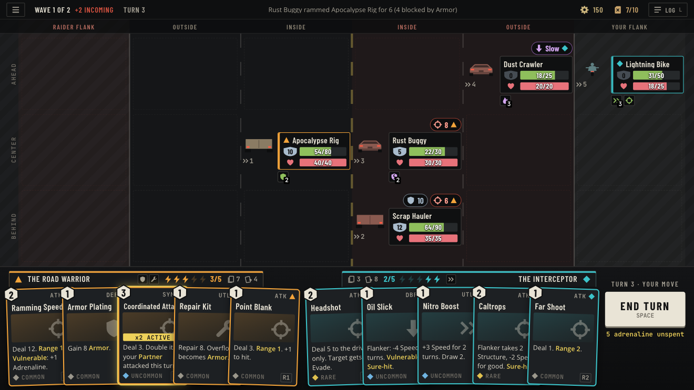

# Battle Screen Design

Status: decided 2026-09-25. Replaces the combat screen layout in Game Flow and UI Specification section 2.2 and the positioning half of `docs/AI_TECHNICAL_DECISIONS/VEHICLE_POSITIONING_AND_WAVE_SYSTEM.md`. The reasoning and the options that lost are in [battle-screen-road-model.md](../AI_TECHNICAL_DECISIONS/battle-screen-road-model.md). The interactive mock, with the fit matrix that checks every number below, is [docs/design/battle-screen/index.html](../design/battle-screen/index.html); open it through any static server (`python3 -m http.server -d docs/design/battle-screen`).



More frames: [every slot full, targeting](../design/battle-screen/proposed/full-road-targeting.png), [the card detail view with the longest full text](../design/battle-screen/proposed/card-detail-view.png). The current screen, for comparison, is in `docs/design/battle-screen/current/`.

## 1. The road

Two convoys drive the same direction on a wide freeway, seen from behind, everyone moving up the screen. Nothing faces anything else. A fight is a raid on a moving convoy.

Lanes run across the screen, left to right:

| Lane | Belongs to | Holds |
|---|---|---|
| Raider flank (shoulder) | the raiders | raiders that outran you and swerved around your outside lane |
| Your outside | you | your formation |
| Your inside | you | your formation |
| Their inside | the raiders | their formation |
| Their outside | the raiders | their formation |
| Your flank (shoulder) | you | your vehicles that outran them |

Rows run along the road: ahead, center, behind. Ahead is further up the screen.

- One vehicle per slot. Eighteen slots: each convoy's formation is its inside and outside lanes by three rows (six slots), plus three flank slots on the far shoulder. Up to nine a side.
- Nine needs an ambush start. A flanker keeps its formation slot reserved, so a side only gets past six when the encounter places some of its vehicles on the other side's shoulder with no reserved slot (Combat Rules, The road). Ambushers are raiders and set-piece escorts; your driven vehicles always start in formation. The Full road scenario in section 10 is a layout stress case: its raider side is a legal ambush, its player side isn't a legal position.
- Your two driven vehicles open in the inside lane; escorts fill the rest of your formation after them, each in its type's preferred slot.
- A shoulder only holds the other side's flankers. Nobody parks on their own shoulder.
- A flanker takes the row of the vehicle it outran. Its old formation slot stays empty and reserved; nobody in the convoy shifts to fill it. When it loses its speed edge it drops back into that slot.
- Slots never move or resize during a fight. Moving is a swerve from one slot to another.
- Say ahead and behind, not front and back. The old Front / Back / Flanking positions map to inside / outside / the far shoulder.

Range is lanes apart plus rows apart, with no diagonal shortcut. From your inside-center slot:

```
            raider   your     your   | their   their    your
            flank    outside  inside | inside  outside  flank
ahead         3        2        1    |   2       3        4
center        2        1      [you]  |   1       2        3
behind        3        2        1    |   2       3        4
```

Inside to inside on the same row is 1, a flanker to their inside lane is 2 (the old "flanking to front is range 2" holds), and anything 3 or more away is out of reach for today's range 1 and 2 cards.

## 2. Screen bands

Everything is laid out in logical pixels on a 1280x720 reference and scaled by one number:

`s = min(W / 1280, H / 720)`, floored at 0.8. The logical canvas is `W/s x H/s`, never smaller than 1280x720, and one axis always grows.

| Band | Height (logical) | Contents |
|---|---|---|
| Top bar | 36 | menu, wave and reinforcements, turn, a one-line ticker of the last log entry, scrap, fuel, log toggle |
| Road | everything left, at least 456 | 26px lane header, an 18px row gutter on the left, then the 6x3 slot grid |
| Dock | 228 | a tab and a fanned hand per driver, End Turn column on the right |

- The stage caps at 1600 logical wide and centres. On 21:9 the road art runs to the screen edges, the UI does not.
- At 1280x720 each slot is 205x141. Spare height goes to the rows, spare width to the slots, and vehicle tokens scale up to x1.25 to fill them. Tokens never scale below x1; a layout that would force that is a failure.
- Below s 0.8 (phone landscape) needs its own compact layout, which this document doesn't cover.
- Rules text on the card face is 12 logical, which is 18px at 1920x1080 (the Xbox accessibility guideline's PC minimum) and 9.6px at the 1024x768 floor.
- One layout function computes all of this, on mount and on resize alike.

## 3. Vehicle token

196x117 logical, the sprite beside the plate so three rows fit.

| Part | Size | Content |
|---|---|---|
| Intents (raiders) | 24 tall, full token width | icon, value, and a target mark; two pills, then "+N" |
| Sprite | 60x40 | rear view, facing up the road; speed chevrons and number under it |
| Plate | 132x68 | vehicle name (15px condensed, ellipsis, full name on hover), armor shield beside the structure bar, driver HP bar at the same weight as structure |
| Passenger row | +18 | only when a passenger rides along; token becomes 135 tall |
| Statuses | 20 tall | five chips under the plate, then "+N" |

- Structure and driver HP get equal weight because you lose when drivers die.
- A wrecked vehicle greys out with a WRECKED stamp for the turn it dies, then leaves the road.
- Target marks: triangle for driver 1, diamond for driver 2, both for an area hit, square for an escort.
- An escort's plate has no driver HP bar, since escorts have no HP. Once it has acted this turn, a SPENT chip leads its status row until the start of your next turn.

## 4. The dock

- Each driver owns half the dock. A tab above their cards shows their mark and name, a PASSENGER tag when it applies, up to four vehicle mod icons then "+N" (none while a passenger, since the mods were on the wreck), adrenaline pips (numbers past six), and draw and discard counts.
- Cards are 128x180 and fan within their half. The overlap tightens as the hand fills; at the 7-card cap about 68px of each card shows.
- End Turn is a 148px column at the right end of the stage (not the screen edge), with the turn number above it and an "N adrenaline unspent" warning under it.

## 5. Cards: short text and full text

Every card carries two texts.

| Text | Where | Budget |
|---|---|---|
| Short | the card face in the hand | three lines at 12px in a 114px box, written with keywords (Range 1, Vulnerable, Sure-hit, Armor, Shield, Partner, Flank, Exhaust) |
| Full | the detail view | 330 characters |

- The detail view is 250 wide with the full text at 15px. It is anchored to the bottom of the screen and grows upward to a 440px cap, shrinking the card art first. Measured capacity is about 357 characters with a two-line name; the budget leaves room for upgraded numbers.
- Keyword definitions sit beside the detail view on whichever side has room, never over the card.
- Opening it: hover with a mouse, focus with keyboard or controller, long-press on touch. Right-click, I, or the controller's inspect button pins it open so you can read while looking at the road. Deck, discard, and reward screens use the same view.
- A short text that runs past three lines, or a full text past 330 characters, is a content bug, caught by a card data check rather than by shrinking type.

## 6. States

| State | What changes |
|---|---|
| Planning | Unaffordable cards dim and their cost turns dark red. Synergy cards that are live show an "x2 ACTIVE" strip. |
| Inspect | Detail view and keyword boxes; the vehicle the card acts from lights up in its driver colour. |
| Targeting | Drag to play. Every raider slot shows its range from the source slot (R1, R2, OUT); out-of-reach raiders dim, legal ones get a dashed outline, the hovered one a solid outline and a damage ghost on the bar it will hit. The hit check (gunnery against evade, and range) rides with the dragged card. Release on the road or right-click cancels. |
| End-turn preview | Pointer on End Turn: each intent draws a line to the vehicle it will hit, and your plates show the incoming total. |
| Enemy turn | The dock drops 60px and greys out, a banner crosses the road (never the dock), raiders act one at a time and the acting raider glows while its hit lands. |
| Log | A 320px drawer over the right of the road, never over the dock or End Turn. Lines wrap and scroll. |

## 7. Colour

Driver identity owns the two strongest hues and nothing else uses them: driver 1 amber with a triangle, driver 2 teal with a diamond. Escorts are neutral bone with a square. Raiders and attack intents are red. Structure green, armor steel, driver HP pink-red. Yellow is keywords, warnings, and the centre line. Rarity is a small gem on the card and never a border colour. Every colour cue has a shape twin.

## 8. Text budget

| Field | Size | Rule past the budget |
|---|---|---|
| Card name | 16 condensed | shrink to 14, then ellipsis; 18 characters fit |
| Card short text | 12 | fails the card data check |
| Card full text | 15 | fails the card data check past 330 characters |
| Driver name (tab) | 15 condensed | ellipsis; never squeezes pips, piles, or mods |
| Vehicle name (plate) | 15 condensed | ellipsis past about 13 characters; full name on hover |
| Intent value | 15 | "6x3" and two digits fit; extra intents collapse to "+N" |
| Ticker | 12 | one line, ellipsis; full text in the log |
| Log line | 13 | wraps in the drawer |

## 9. Rules this screen assumes

These are decided and recorded in Combat Rules; they're listed here because the layout depends on them.

- Two driven vehicles at most. A bigger convoy grows through escorts: vehicles with slots and plates but no hand, ordered with cards. A third human player is co-op, not a third hand.
- Up to four escorts in formation. Each acts only when ordered, once per turn. An attack order is dropped on a raider, and the nearest ready escort in range carries it out; that escort lights up during the drag. A buff order is dropped on the escort itself, spent or not. Attack orders and Draw Fire spend the escort; Close Ranks and Triage don't. When Draw Fire redirects an intent, its target mark moves to the escort's square, so the end-turn preview shows it.
- Raiders can start on your shoulder, at the start of a fight or when their wave arrives, and a set-piece escort can start on theirs (ambush starts). With no reserved slot to drop back to, they hold it.
- Each driver has their own deck, hand, discard, and adrenaline pool.
- Hand cap 7 per driver; draws past 7 go straight to discard.
- Every vehicle, escorts included, has one passenger seat. A wreck's occupants jump, driver first, to the partner's vehicle or the nearest escort with a free seat. A passenger keeps their hand, can't play attack cards, and can play order cards. A driver with no free seat crashes out of the fight, alive, and their half of the dock has no hand.
- A driven vehicle whose driver dies with no passenger becomes an escort for the rest of the fight.
- Flanking deals +50%.
- The same driver can't fill both slots.

## 10. Worst cases the layout is checked against

The mock runs each of these at 1920x1080, 1440x882, 1280x800, 1280x720, 2560x1080, and 1024x768, in planning, inspecting the leftmost and rightmost cards, targeting, and end-turn preview, and fails any render with text overflow, collisions between vehicles, chips, and cards, a token scaled below x1, anything outside the frame, or a slot-rule violation (a vehicle on its own shoulder, a flanker in a row with no opposing vehicle, checked at placement only since the vehicle opposite can be wrecked later, two vehicles in one slot, a hand over the cap).

| Scenario | What it stresses |
|---|---|
| Typical | the everyday turn, one flanker |
| Opening | both of your vehicles in the inside lane, how fights start |
| Big convoy | escorts, raiders flanking you |
| Full road | all 18 slots, a boss with three intents, three-digit stats, over-long names |
| Passenger | a wreck, the passenger HP row, a hand that can't attack |
| Big hands | 7 cards per driver, six mods each, the longest full text in the detail view |

All 180 renders pass as of 2026-09-25. When the screen is built, these scenarios become gallery scenes and Playwright cases (see the Specboard epic).
