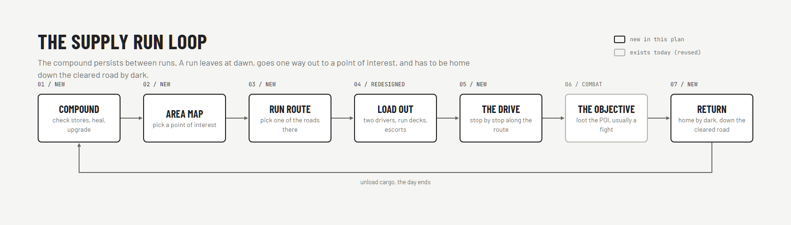
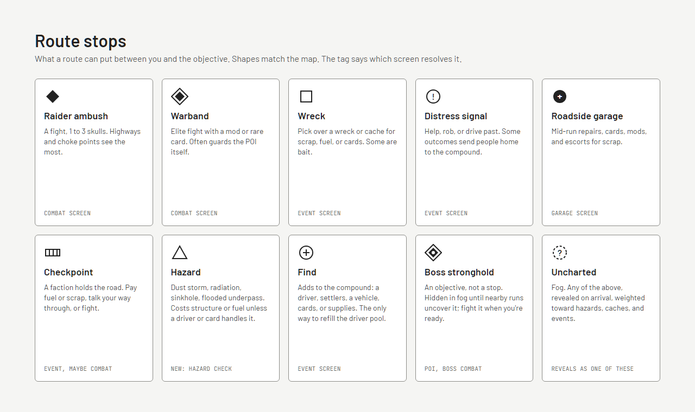
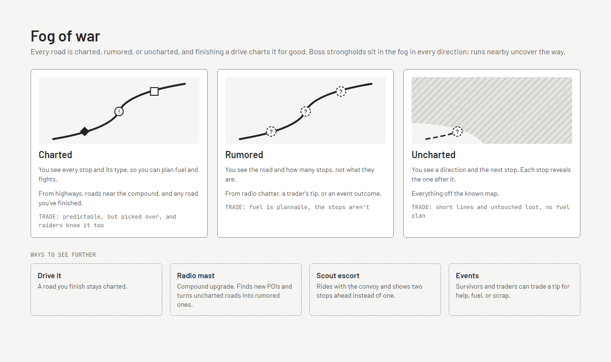

# Compound and Supply Runs

Status: designed 2026-10-06, not built. Wireframes: the "Supply Run Map" design canvas (https://claude.ai/artifact/SokU9WnQ3MDSUEb8PYxs5F). Map generation: [Area Map Generation](./Area%20Map%20Generation.md). Decision record: [compound-and-area-map.md](../AI_TECHNICAL_DECISIONS/compound-and-area-map.md). Wireframe screenshots (low fidelity, from the canvas) are in `docs/design/supply-runs/`.

This replaces the single long run up a map to a region boss. The player runs a compound trying to survive, and plays the game as a series of supply runs out into the wasteland and back. Combat, cards, escorts, and the garage, event, and reward screens are unchanged; this spec is the layer around them.

## Terms

- Campaign: one save, from founding the compound to its fall or victory. This is the roguelike "run" for meta-progression.
- Compound: the player's settlement. It persists for the whole campaign and holds the resources, the driver pool, the vehicles, and the convoy.
- Supply run (a run): one trip out from the compound to a point of interest. Runs are one way out; the trip home is down the road just cleared.
- Area map: the whole known region around the compound. Open at any time outside a fight or an event.
- Point of interest (POI): a destination on the area map with something worth taking. A run always targets one.
- Roads: the highways out of the ruined metro the compound sits in, branching outward into back roads and trails. They form trees reaching away from the compound, not a web; see Area Map Generation.
- Route: the road path from the compound to a POI. Each POI offers 2 or 3 routes, arriving from different branches; past the home area they share nothing.
- Stop: something waiting on a road (a fight, an event, a find, a hazard). A run resolves its route's stops in order.
- Stronghold: a POI whose objective is a boss fight, the seat of a faction.

## The loop

1. Compound: read the needs panel, spend scrap in the garage, tune default decks on the Crew screen, heal and rest drivers, check stores.
2. Area map: pick a POI.
3. Run route: compare the 2 or 3 routes to it and pick one.
4. Load out: two drivers from the pool, each taking their default deck unless you customize it for this run, escorts, and the fuel the route costs. This replaces the old driver selection screen.
5. The drive: resolve each stop on the route in order.
6. The objective: the POI's own encounter, usually a fight; for a stronghold, the boss.
7. Return: home down the cleared road before dark, unload the cargo, and the day ends. Back to 1.

## The compound

The compound screen is the game's home screen. It's an illustrated scene where the buildings are the menu, with the resources and day along the top and a needs panel beside it.

### Resources

| Resource | Used for | Comes from |
| --- | --- | --- |
| Food | daily upkeep | finds, POIs |
| Water | daily upkeep | finds, POIs (water plants, wells) |
| Fuel | paying for routes; some cards | finds, POIs, the Fuel Hauler dividend |
| Meds | healing drivers faster; some events | finds, POIs (hospitals, pharmacies) |
| Scrap | garage purchases, repairs, building upgrades | fights, finds, POIs |
| People | settlers; their count sets upkeep and what the buildings can do | Find stops, events |

Scrap and fuel already exist in combat and the top bar; they now live at the compound and carry across runs.

### Hours on the road, days at home

- A run leaves at dawn and has to be home by dark. It's measured in hours: driving each road (by class and length), each stop, the objective, then the drive home down the cleared road, which is quicker with nothing left to stop for.
- Daylight is set per campaign (starting value: dawn 06:00, dark 20:00, 14 hours; the `daylightHours` map parameter).
- One run per day. Getting home ends the day; resting at the compound without a run also takes a day.
- Each day the compound eats: food and water scale with People (starting value: 1 of each per 4 people, rounded up).
- A shortfall costs people (settlers leave or die) and raises unrest. Shortages shrink the compound; they don't end the campaign by themselves (see Open questions).
- The needs panel shows the forecast: "Food runs out in 6 days."

### Buildings

- Garage: the existing garage screen (cards, mods, escort repair and hire), now at home as well as on the road. Cards bought at home go to the locker.
- Infirmary: injured drivers heal over days; meds speed it up.
- Stores: the resource ledger and its forecast.
- Bunkhouse: the driver pool and settlers, and the Crew screen, where each driver's default deck is built from the locker (see Decks and the locker). Its size caps the pool.
- Radio mast: rumors. Finds new POIs and turns uncharted roads near known ground into rumored ones (see Fog of war). Upgradable.
- Map room: opens the area map with "Plan a run" selected.

Building upgrades cost scrap and sometimes a specific find (a radio part, a generator). The list is a starting set, not final.

### Never stuck

The compound can always send a scavenging party on foot: it costs a day and returns a little fuel and scrap, with no fight. This stops a compound with no fuel from soft-locking.

## The driver pool

- The campaign starts with a pool of four drivers, drawn from the unlocked archetypes with no duplicates.
- A run takes two. The no-duplicate pair rule still holds for the pair; the pool itself can hold two of an archetype once finds add drivers.
- Drivers persist across runs, and so do their decks (see Decks and the locker).
- Driver HP carries between fights on a run, as it does now. A driver who comes home hurt is injured and heals over days in the infirmary.
- Death is permanent. A driver killed on a run is gone, with their deck.
- The only way to grow the pool is a Find: driver stop (or an event outcome that does the same).
- When the last driver in the pool dies, the campaign ends. The compound falls: it starves, riots over what's left, or disbands, chosen by its state at the end (no food: starves; high unrest: riots; otherwise disbands). That's the defeat screen.

## Decks and the locker

Every driver has a default deck and a hand limit. The compound keeps a locker of spare cards. Decks are managed in two places: permanently on the Crew screen at the compound, and for one run only at load out.

### The rules

- Every card copy is in exactly one place: a driver's default deck, the locker, or (during a run) a driver's run deck. Nothing is duplicated by moving it.
- Hand limit: each driver has their own, shown with their deck. It starts at 7 for every archetype and is a driver stat that archetypes, mods, or upgrades can change.
- Deck size: a deck stays between a minimum and a maximum (starting values: 8 and 20), at home and on a run.
- Card eligibility: most cards can go in any driver's deck. A card marked for an archetype (a future signature card, say) only goes to that archetype.
- Starting decks: a driver arrives with their archetype's starting deck as their default deck. Find: driver brings a new driver with their own starting deck.

### At the compound: the Crew screen

Opened from the bunkhouse. Pick a driver from the roster; their default deck is on one side and the locker on the other.

- Add a card from the locker to the default deck, or remove one back to the locker. Moving cards at the compound is free.
- Scrap a card from the locker for a little scrap, to thin out what you'll never use.
- The deck shows its size against the limits, the hand limit, and the cost curve.

This replaces the garage's paid card removal: with a locker, taking a card out of a deck isn't a loss, so it doesn't cost anything.

### At load out: run decks

Each seated driver takes a run deck that's a copy of their default deck. Load out shows it, view only, and most runs leave like that. "Customize" opens one driver's run deck in the same layout as the Crew screen; each driver is customized on their own. For this run only:

- Leave cards at home (back to the locker for the day) or borrow cards from the locker, inside the deck size limits. A locker card borrowed by one driver isn't available to the other.
- Escort signature cards are added automatically, to Driver 1 unless the player gives them to Driver 2, shown locked; each leaves when the run ends or the escort is lost (Combat Rules, Escorts).
- "Reset to default" undoes the run's changes. The default decks never change here.

### After the run

- A driver who comes home has their run deck unwound: their default cards go back to their default deck, borrowed cards go back to the locker, and escort cards leave.
- Cards won on the run (rewards, finds, a roadside garage) go to the locker. The debrief offers to add each one straight into a driver's default deck.
- A driver who dies takes their whole run deck with them: their default cards and anything they borrowed. Borrowing a rare card for a dangerous run is a real risk.

## The area map

Open at any time outside a fight or an event: from the compound's top bar, the map room, the run route screen, and between stops on a run. Looking costs nothing.

It shows:

- The compound, at the centre, in the ruins of a metro area, with highways leaving it in every direction and branching as they go.
- Every known POI, with what it yields, its tier, and its state (unvisited, looted, depleted).
- Drivable roads, drawn by what you know of them: charted roads solid, rumored roads solid with "?" stops, uncharted roads as dashed lines fading into fog.
- Scenery: town streets, county roads, rail lines, and broken pre-war highways that make the region look real. They're drawn lighter and can't be driven or selected; only the drivable network carries runs.
- Fog over everything not yet uncovered.
- Strongholds you've found. Others are hidden in the fog in every direction.
- Explored percentage and strongholds found.

Selecting a POI shows its yields, objective, tier, and how many routes are known, with "Plan a run here", which opens the run route screen for it.

### POIs

- Each POI has a yield table (meds and scrap for a hospital, water for a water plant) and an objective: a fight, an elite fight, an event, or for a stronghold a boss.
- A POI holds a limited amount. Each successful run takes a share, and after two or three it's depleted, which pushes the compound outward. A depleted POI can refill over many days (starting value: 20).
- New POIs come from exploring (the fog lifts over them), the radio mast, and events.

## The run route screen

A zoomed view of the area map between the compound and the chosen POI, with its routes. Each route card shows:

- Name and road type (highway, back roads, a named stretch like "Through the Mire").
- Knowledge: charted, rumored, or uncharted.
- Stops in order, as far as known.
- Fuel cost, hours (out, at the objective, home), the time you'd be back against dark, and risk.

Routes to a POI arrive from different branches and share nothing past the home area, so picking one is a real choice between different stops. POIs are dead ends: no road continues from one objective to another. Fuel is paid at departure, so a route can't strand the convoy part way. An uncharted route's fuel and hours are estimates, settled on arrival; hazards can cost more on the way.

"Load out the crew" goes to load out with this route attached.

## The drive

- Stops resolve in order. Each opens its screen (combat, event, garage) and comes back to the route view, which shows progress and the next stop.
- No branching mid-route in the first version: the route is fixed at departure.
- The area map is open between stops.
- Rewards from fights (cards, scrap) apply as they do now. Resources found are cargo until you get home.

### Return

- Runs are one way. After the objective, the convoy comes home down the road it took, which is safe because you cleared it on the way out.
- From the middle of the game on, a return can roll a rare ambush: one fight on the way home, with cargo at stake. Its chance scales with game stage (starting values: 0 early, rising to about 15% late). It's meant to be memorable, not routine.
- Arriving home unloads the cargo, charts every road driven, and ends the day.

### Racing the dark

- The clock runs through the whole run. Each stop takes time (starting values: fight 1 hour, warband 1.5, event or find 0.5, roadside garage 1, hazard 0.5 to 2, objective 1 to 2), and the route view shows the time and the projected return after every stop. Hazards and uncharted stops can cost hours as well as fuel or structure.
- Early in a campaign every POI can be reached and left in daylight: generation keeps at least one route to every POI in tiers 1 to 3 inside the daylight window (Area Map Generation, guarantee 10).
- Further out, routes start running past dark. That's the late-game turn: the far POIs and the strongholds are where runs go into the night.
- The route screen warns before leaving on a route whose estimate runs past dark, and the area map marks POIs you can't reach and leave by daylight.

### Night

Being out after dark is where bad things happen. Night has its own set of challenges, to be designed. Directions to explore:

- Night encounters: tougher raiders and creatures that only come out after dark.
- Headlights: an uncharted road reveals less ahead, and fights start with less information (hidden intents, a shorter range).
- The return ambush becomes likely rather than rare.
- Holing up: spend the night at the POI and come home at dawn, at the cost of a day away from the compound and its upkeep.
- The compound at night: is it safe without its drivers?

Until night rules exist, a run that slips past dark rolls the return ambush at full odds.

### A failed run

- A run fails when a fight has no driver left in it (Combat Rules, Losing vehicles and drivers). The dead are gone. A driver who crashed out alive is missing: there's nobody left to pick them up. A missing driver can turn up later as a Find: driver stop.
- The cargo and the run's escorts are lost.
- The campaign goes on while the pool has drivers.

## Stops

Each stop type has a map shape, and resolves through an existing screen where possible.

| Stop | What it is | Screen |
| --- | --- | --- |
| Raider ambush | a fight, 1 to 3 skulls | combat |
| Warband | an elite fight with a mod or rare card | combat |
| Wreck | pick over a wreck or cache; some are bait | event |
| Distress signal | help, rob, or drive past | event |
| Roadside garage | repairs, cards, mods, escorts for scrap | garage |
| Checkpoint | a faction holds the road: pay, talk, or fight | event, maybe combat |
| Hazard | storm, radiation, sinkhole, flooded underpass; costs structure or fuel unless a driver or card handles it | new hazard check |
| Find | adds to the compound: a driver, settlers, a vehicle, cards, or supplies | event |
| Uncharted | a fogged stop, revealed on arrival as one of the above | as revealed |

Find is the compound's growth. Its five kinds:

- Driver: joins the pool (a new archetype or a missing driver).
- Settlers: People, if there's room and food.
- Vehicle: an escort for the convoy, or a replacement driven vehicle.
- Cards: cards for the locker.
- Supplies: food, water, fuel, meds, or scrap.

## Fog of war

Every road is in one of three states, and what you see depends on it.

- Charted: every stop and its type. From the starting area around the compound, highways in known ground, and every road you've finished driving.
- Rumored: the road and how many stops, not what they are. From the radio mast, a trader's tip, or an event.
- Uncharted: a direction and the next stop. Each stop reveals the one after it as you drive.

Charting is permanent, but stops aren't: a cleared road is safe for that run's return, and its stops come back over the following days (starting value: a re-roll after 5 days), with the road still charted so you see what's there.

Fog over land lifts around every road you drive and every POI you reach (see Area Map Generation, Fog). Ways to see further: drive it; the radio mast; a scout escort that shows two stops ahead instead of one; event tips.

## Strongholds and bosses

- Strongholds sit in every direction at the edge of the area, each the seat of a faction (Faction Concepts), and all start in fog.
- Runs near one uncover the roads to it. Once one is found, the player decides when to fight it. There's no forced boss: you can keep doing non-boss runs to grow the pool, the decks, and the compound first.
- A stronghold run is a normal run whose objective is the boss fight. Losing it costs what any failed run costs.
- Taking a stronghold breaks that faction locally: its checkpoints open and stops in its territory get easier. It also pays a large reward and an unlock.

## Game stage and difficulty

- Difficulty comes from two things: the tier of the roads and POI (distance from the compound, set at generation) and the game stage (strongholds taken and days passed).
- Tier sets the encounter pool and skull counts. Game stage scales enemies within it and turns on the rare return ambush.

## Co-op

Unchanged in spirit: the two players share the compound and decide runs together, each driving one of the run's two drivers.

## Open questions

1. Victory: does the campaign end when every stronghold has fallen, or does taking them reveal a final boss? Proposal: every stronghold, so the end is player-paced.
2. Can shortages alone end the campaign (say, People reaches 0), or only the last driver's death?
3. Deck limits: 8 to 20 cards, and whether the hand limit should differ by archetype from the start.
4. Vehicles: a driver's signature vehicle is theirs; does a found vehicle become an escort only, or can it replace a destroyed driven vehicle?
5. Mid-route branching at junctions: worth adding later, or never? (The road trees make it possible: a junction is a place a run could change its mind.)
6. Starting pool size (4) and whether the player picks it or it's dealt.
7. Night rules (see Night).
8. One run per day, or can two short runs fit in a day's light?
9. Driver names: drivers now persist, and the pool can hold two of an archetype, so "THE ROAD WARRIOR" isn't enough to tell them apart. Give each driver a personal name, with the archetype as their title?
