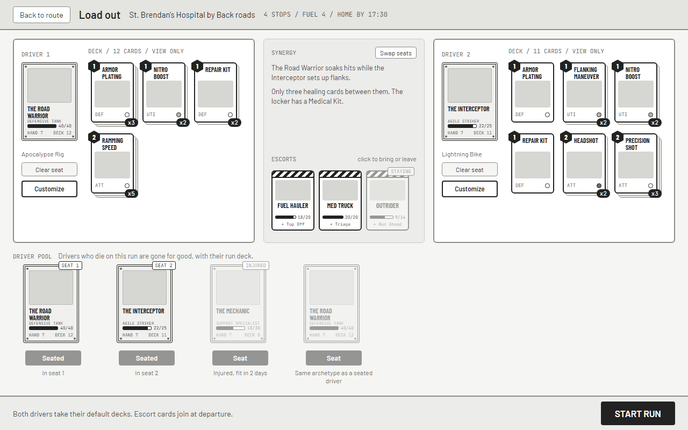
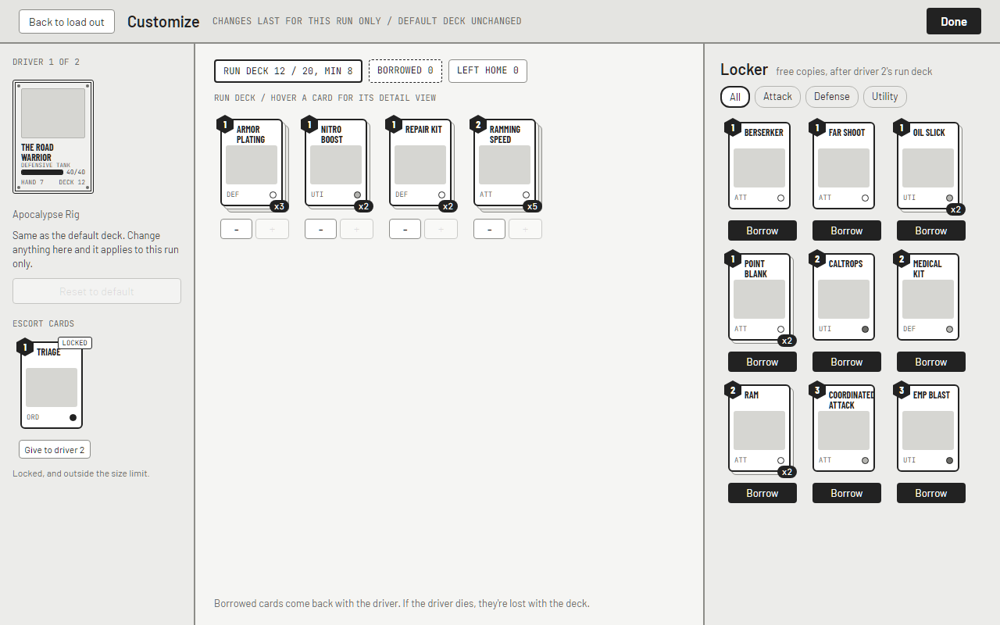
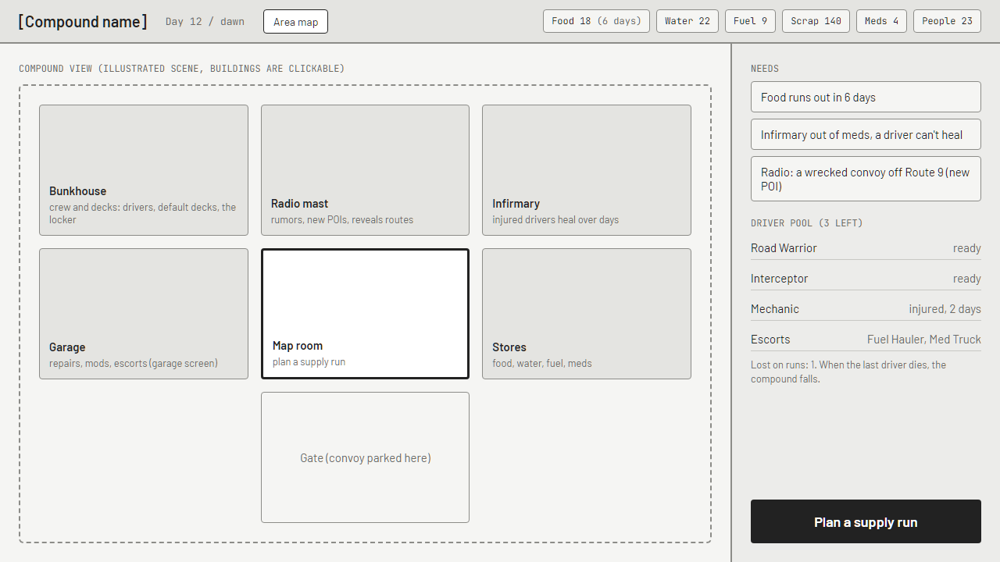
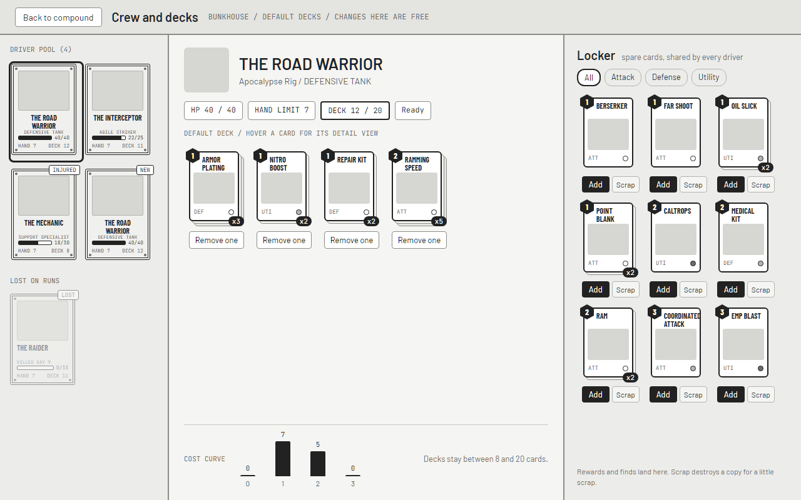
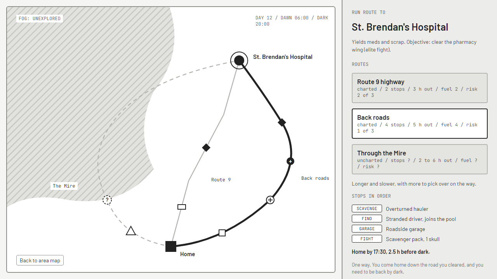
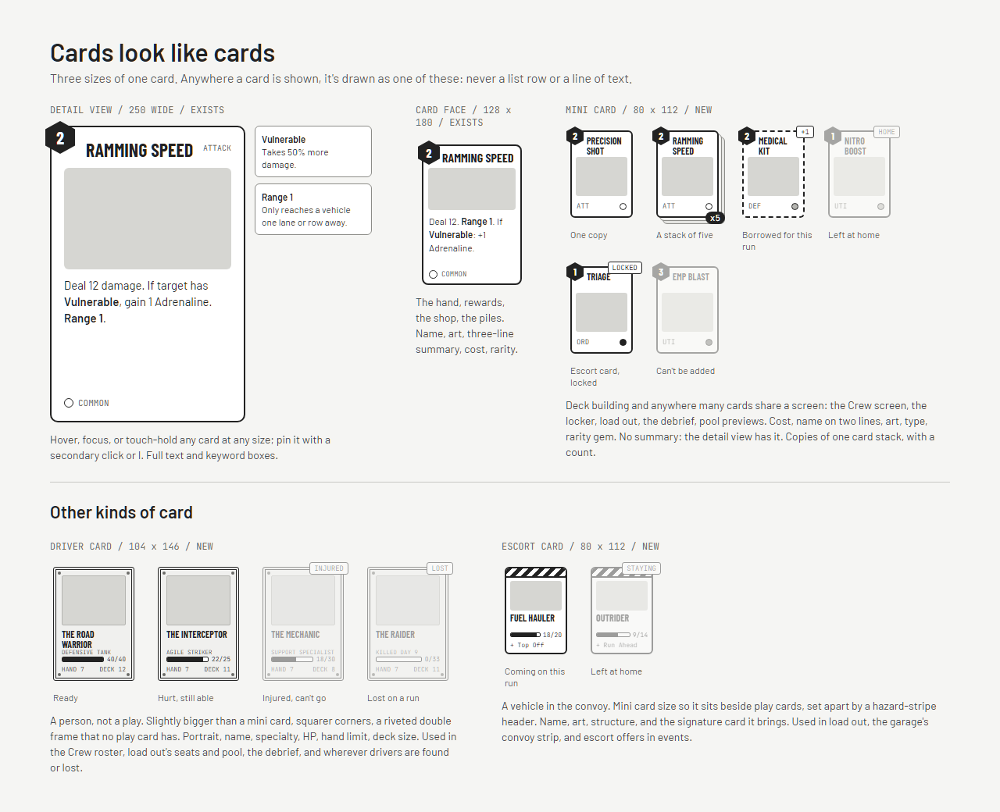

# Game Flow & UI Specification

## 1\. Game Start Flow

The game is a campaign: the player runs a compound and sends supply runs out from it. The full structure (compound, driver pool, area map, run route, stops, fog, strongholds) is in [Compound and Supply Runs](./Compound%20and%20Supply%20Runs.md); this document covers the screens.

### 1.1 Main Menu → New Campaign

When a player launches the game, they'll see the main menu. "New Campaign" is the largest and most visually prominent button: it founds a compound on a freshly generated area map ([Area Map Generation](./Area%20Map%20Generation.md)) and opens the compound screen. Below it, if a campaign is in progress, "Continue" shows its state (e.g., "Day 12 - 3 drivers - 1 stronghold taken"). At the bottom, "Campaign History" lists past campaigns: days survived, strongholds taken, unlocks earned, and how the compound fell.

There will need to be buttons to see what cards have been (the original note stops here).

### 1.2 Load Out (Driver Selection and Run Decks)

#### User Scenario

Load out is the last step before a supply run leaves: after picking a POI and a route, the player picks two drivers from the compound's pool and can customize either one's deck for this run. The screen needs to communicate that they're choosing a team of two drivers who will work together on this run, that any deck changes are for this run only, and that drivers who die on it are gone for good, with everything in their run deck. It replaces the old two-halves driver selection screen. Wireframes: "Load out" artboards on the design canvas.

Load out is one screen. Most runs go out on the drivers' default decks, so deck changes are an optional mode, not a step. A run summary bar runs along the top: the POI, the route, its stops, fuel, and the time you'd be home against dark, with a way back to the run route.

**Seats:** Two tall seats across the top, Driver 1 and Driver 2, each empty ("Choose a driver") until filled. A filled seat shows the driver's card (section 7.0), vehicle, and the Clear seat and Customize buttons on the left, and on the right the deck they'll take as mini cards in two rows, view only (hover for the detail view). A customized run deck shows a "CUSTOM" tag on the driver card. A swap control exchanges the two seats.

**The pool:** Below the seats, every driver at the compound as a driver card with a Seat button and a status line under it. Clicking Seat fills the first free seat. Unavailable drivers stay visible but faded and can't be picked, with the reason under the card: "Injured, fit in 2 days", or "Same archetype as a seated driver" (the no-duplicate pair rule).

**Synergy and escorts:** Between the seats, hints about how the pair works together (not specific card combinations), and the convoy's escorts as escort cards; clicking one brings it or leaves it at home (faded, "STAYING"), up to four on a run. For example:

- "The Road Warrior's defensive capabilities will protect The Interceptor during setup turns"
- "These drivers share several Ramming-type cards that benefit from armor bonuses"
- "Warning: Both drivers lack healing options - consider borrowing a Medical Kit from the locker"

**Confirmation:** "START RUN" sits at the bottom right with the summary beside it. It's disabled until both seats are filled, or while a customized deck is outside the size limits, with the reason shown.

#### Customize

Opened from a seat's button, for that one driver; each driver is customized on their own. The layout is the Crew screen's (section 3.2) so the two feel like the same tool: the driver on the left where the roster was, the run deck as mini cards in the middle, the locker on the right.

- The run deck starts as the default deck. Each card has one-fewer and one-more controls. A card borrowed from the locker shows dashed with a "+1" tag; a card left at home shows faded with a "HOME" tag until restored.
- The locker shows the copies still free after the other driver's run deck, each with a Borrow control. A card only one archetype can use only offers itself to that driver.
- Escort signature cards assigned to this driver sit in the left column, locked and outside the size limit, with a control to give each to the other driver. By default they go to Driver 1.
- The header says the changes last for this run only. "Reset to default" undoes them; "Done" returns to load out.

### 1.3 Decks

Each driver has a default deck and a hand limit, kept for the whole campaign. Default decks are built at the compound's Crew screen (section 3.2) from the locker, the compound's store of spare cards; run decks are adjusted at load out for one run. Cards won on a run go to the locker, and a driver who dies takes their run deck with them. Rules: [Compound and Supply Runs](./Compound%20and%20Supply%20Runs.md), Decks and the locker. In combat each driver keeps their own deck, draw pile, hand, discard, and adrenaline pool; you choose which driver acts with every card you play.

## 2\. Combat Screen UI

### 2.1 The Battlefield - User Scenario

When combat begins, the screen transitions to show a post-apocalyptic battlefield. The player needs to quickly assess threats, manage resources, and coordinate attacks between their two vehicles. The layout is designed to give all critical information at a glance while keeping the action focused on the center of the screen.

### 2.2 Screen Layout Description

The full layout, sizes, and text budgets are in [Battle Screen Design](./Battle%20Screen%20Design.md); this section is the player-facing summary.

**The road (everything between the top bar and the dock):** Both convoys drive up the screen on a wide freeway, seen from behind. Your convoy takes the two lanes left of centre, the raiders the two lanes right of it, and the two inside lanes meet at the centre line where the fight is closest. Each lane has three slots along the road: ahead, center, and behind. The shoulder past your outside lane only fills with raiders that outran you, and the shoulder past theirs only with your vehicles that outran them. Range is how many lanes and rows apart two vehicles are.

Each vehicle shows a rear-view sprite beside a plate with its name, an armor shield beside its structure bar, its driver's HP bar at the same size as structure (you lose when drivers die), a passenger's HP when someone is riding along, speed, and up to five status icons. Raiders show their intent above the plate: an icon, a value, and a mark for which of your vehicles they're aiming at, with up to two intents shown and the rest as "+N". Intent icons:

- A crosshair with a damage number for attacks (e.g., crosshair with "15" means 15 damage incoming)
- A shield for defensive moves
- A down arrow with the effect name for debuffs
- A question mark for hidden intents

**Top bar:** wave and incoming reinforcements, turn number, the latest combat log line, scrap, fuel, and the log button.

**The dock (bottom of the screen):** Each driver owns half. A tab above their cards shows the driver's name, adrenaline (lightning bolts with "3/5" text), draw and discard counts, and their vehicle's mods. Their cards fan out underneath, bordered in the driver's colour. Each card shows:

- The adrenaline cost in the top left corner (in a hexagonal badge)
- The card name
- Card art that illustrates the action
- A short effect text built from keywords; the full text is one hover away in the card detail view
- A small gem for rarity

Cards in your hand lift on hover. Cards the driver can't afford are darkened and their cost turns red.

**End Turn:** a large button at the right end of the dock, with the turn number above it and a warning when adrenaline is left unspent.

### 2.3 Playing Cards - The User Experience

When a player clicks and holds a card, the battlefield dims slightly to reduce distractions. Valid targets begin glowing:

- Enemy vehicles glow red for attack cards
- Your vehicles glow green for defensive/healing cards
- All vehicles glow yellow for area effects

Every enemy slot shows its range from the vehicle playing the card, and targets out of range dim. As you drag the card toward a target, a preview line connects the card to the potential target, the hit check (gunnery against evade) rides along with the card, and the target shows a preview of the effect (e.g., "-12 HP" floating above an enemy when targeting with an attack).

If a card has multiple effects or conditions, these are highlighted as you aim. For example, a card that says "Deal 10 damage, deal 15 instead if target is Burning" would show "-15" in red text if targeting a burning enemy.

When you release the card on a valid target, it flies from your hand to the battlefield, the effect animation plays, and resources update immediately. The card then flies to the discard pile with a satisfying animation.

### 2.4 Turn Flow Experience

**Beginning of Your Turn:** When your turn begins, several things happen in sequence to create a smooth flow:

1. The "Enemy Turn" overlay fades away
2. Your adrenaline refills with a satisfying animation (empty lightning bolts fill with energy)
3. Cards are drawn from your deck with a swooping animation, fanning out into your hand
4. Any start-of-turn effects trigger with appropriate visual feedback
5. A subtle audio cue plays to indicate it's your turn to act

**During Your Turn:** Players can take actions in any order. The interface is designed to encourage experimentation:

- Hovering over cards shows their full effect without committing
- The game displays running totals (e.g., if you play multiple armor cards, you see your armor value increasing)
- Combo indicators appear when cards would synergize (e.g., if one driver plays a "Vulnerable" debuff, attack cards in your hand might pulse to indicate bonus damage)
- You can see a preview of end-turn consequences (which enemies will attack which vehicles)

**Ending Your Turn:** When you click "End Turn," there's a brief pause as your remaining hand cards fly to the discard pile. Then the enemy turn begins with clear visual indicators of their actions playing out in sequence.

## 3\. Compound, Area Map, and Run Route Screens

Rules for these screens are in [Compound and Supply Runs](./Compound%20and%20Supply%20Runs.md). Wireframes are on the "Supply Run Map" design canvas.

### 3.1 The Compound

The home screen. An illustrated scene of the compound where the buildings are the menu (garage, infirmary, stores, bunkhouse, radio mast, map room), resources and the day along the top, and a needs panel beside it: shortage forecasts, injured drivers, new rumors. The main action is "Plan a supply run", which opens the area map.

### 3.2 The Crew Screen

Opened from the bunkhouse. Where each driver's default deck is built.

- **Roster (left):** every driver in the pool as a driver card, the selected one ringed. Drivers lost on runs are below, faded with a "LOST" tag, for the record.
- **Default deck (centre):** the selected driver's header (name, vehicle, specialty, HP, hand limit, deck size against the limits), then their deck as mini cards, copies stacked with a count, a remove control under each, and the cost curve underneath.
- **Locker (right):** the compound's spare cards as mini cards with copy counts, filterable by type, each with an add control (disabled with a reason when the deck is full or the card is for another archetype) and a scrap control that destroys a copy for a little scrap.
- Hovering any card opens the card detail view. Moving cards here is free.

### 3.3 The Area Map

The map is presented as a worn, hand-drawn chart spread across a rusted metal surface. The art style suggests this is a map your drivers are actually consulting, complete with notes scrawled in margins and roads marked in grease pencil.

**Always open:** from the compound, from the run route screen, and between stops on a run. Outside a fight or an event there's always a way to it.

**Visual Presentation:** The compound sits at the centre in the ruins of a metro area, with highways leaving it in every direction, bending with the land and branching into back roads and trails. The background shows the terrain - destroyed highways, ruined towns, toxic swamps, badlands - and fog covers everything not yet explored. Strongholds hide in the fog at the edges.

**What it shows:** every known POI with its yields, tier, and state (unvisited, looted, depleted); roads by what you know of them (charted solid, rumored solid with unknown stops, uncharted dashed into the fog); strongholds found; explored percentage. Selecting a POI shows its details and "Plan a run here".

**Your convoy:** during a run, the convoy's marker shows where it is on its route and how many escorts are travelling with it, as a small count beside it. Escorts are the undriven vehicles in your convoy ([Combat Rules](./Combat%20Rules.md), Escorts).

### 3.4 The Run Route

A zoomed view between the compound and the chosen POI, showing its 2 or 3 routes. Picking a route card highlights it on the map and lists its stops in order, as far as they're known, with fuel, hours, the time you'd be home against dark, and risk. A route that would run past dark is flagged before you leave. The routes arrive from different branches of the road network and share nothing past the home area. "Load out the crew" goes to driver selection.

**Stop Representation:** Each stop on a route is an icon that immediately communicates what awaits:

- **Raider ambushes** show a danger level indicator (1-3 skulls)
- **Warbands** display a larger, more ornate skull with spikes, promising both greater danger and rewards
- **Roadside garages** are marked with a wrench and gear icon, clearly indicating a safe haven
- **Wrecks** show a partially buried cache or overturned vehicle
- **Finds** show what they add: a driver, settlers, a vehicle, cards, or supplies
- **Checkpoints and hazards** carry their faction mark or hazard symbol
- **Uncharted stops** display a question mark until the convoy reaches them

**Risk/Reward Indicators:** Each route is coded to show risk vs reward:

- Trails through rough terrain carry more hazards and better finds
- Highways are fast and cheap on fuel, but raiders and checkpoints know them too
- Some routes show environmental hazards like radiation symbols or storm clouds

During a run the same view shows progress: cleared stops checked off, the next stop highlighted, and the clock with the projected return against dark.

## 4\. Garage (Shop) Screen

### 4.1 Your Makeshift Pit Stop

The garage screen is where players spend their hard-earned scrap to improve their chances of survival. The same screen serves the compound's own garage, which can work on any driver in the pool, and roadside garages on a run, which work on the two drivers on it. The atmosphere should feel like a gritty, improvised repair shop - oil stains, hanging chains, sparks flying from welding torches in the background.

### 4.2 Screen Organization and Flow

**Header Section - Your Resources:** At the top of the screen, your current scrap amount is prominently displayed with a gear/currency icon. This updates in real-time as you make purchases, with spent scrap flying away and remaining amount clearly visible.

**Left Panel - Deck Management (30% of screen):** At a roadside garage, this section shows the two run drivers' run decks side by side, each as a scrollable grid of mini cards. A card removed here goes back to the compound's locker when the run gets home, so removal is free; the paid removal of the old design is gone. At the compound's own garage this panel is replaced by a link to the Crew screen (section 3.2), where default decks are managed.

For each deck:

- The driver's portrait and name appear at the top
- Each card is a mini card, copies stacked with a count
- Each card has a "Set aside" control, sending it to the locker
- Hovering over a card shows its full-size version
- Deck statistics are shown at the bottom (average cost, card type distribution)

**Center Panel - New Cards (40% of screen):** The shop typically offers 3-5 new cards for purchase. These are displayed as full-size cards that slowly rotate or have subtle animation to draw attention. Each card shows:

- The full card art and effects
- The scrap cost prominently displayed
- A dropdown or button set to choose which driver should receive the card
- A "SOLD" stamp that appears after purchase

Cards might be grouped by rarity, with common cards on the left and rarer options on the right with more elaborate frames.

**Right Panel - Vehicle Modifications (30% of screen):** This section offers permanent upgrades that affect vehicles rather than decks. Typically 2-3 mods are available, displayed as mechanical components with clear descriptions:

- A visual representation of the mod (e.g., spiked bumper, armor plating)
- Name and description of the effect
- Cost in scrap
- Which vehicle(s) it applies to

**Convoy strip (in the mods panel):** one entry per escort you own, up to four (five after a fight that turned a driven vehicle into an escort, until you dismiss one), each with its structure and two actions. Repair restores structure for scrap, since escort damage carries over between fights. Dismiss removes the escort and its signature card from your deck. Escorts for hire are offered in the same strip; at four, you dismiss one before hiring another.

**Bottom Section - Leave Button:** A large "Return to the Wasteland" or "Leave Garage" button sits at the bottom center. The game should prevent players from leaving accidentally if they have enough scrap for meaningful purchases, perhaps with a confirmation: "You still have 200 scrap. Are you sure you want to leave?"

## 5\. Event Screen

### 5.1 Narrative Moments in the Wasteland

Events are crucial for both storytelling and strategic decision-making. When players select an event node, they're presented with a full-screen narrative moment that breaks up the combat-focused gameplay.

### 5.2 Event Screen Composition

**Visual Presentation:** The event screen uses a storybook-like layout. The top half (or left side on widescreen) displays a detailed illustration that sets the scene. This isn't just decorative - the art should tell part of the story. For example, an event about desperate survivors might show their broken-down vehicle with raiders circling in the distance like vultures.

**Narrative Text Section:** Below or beside the illustration, the event text is presented in a weathered journal style, as if written by someone chronicling their journey through the wasteland. The text is broken into two parts:

1. **The Setup**: 2-3 sentences describing what you encounter
2. **The Situation**: Additional detail that explains why a decision is needed

For example: "Your convoy crests a sandy ridge to find a disturbing scene below. A family's makeshift vehicle lies on its side, smoke pouring from the engine.

Three raider buggies circle the wreckage like predators, their occupants whooping and firing shots into the air. The family huddles behind their overturned vehicle. You have moments to decide."

**Choice Presentation:** Choices are presented as distinct cards or panels, each with:

- **A clear action title** (e.g., "Charge the Raiders" or "Negotiate Safe Passage")
- **Risk/Reward indicators** shown as icons:
  - Crossed swords for combat risk
  - Skull icons for danger level (1-3 skulls)
  - Resource costs shown with their icons (fuel can, scrap gear, etc.)
  - Potential rewards shown as glowing positive icons
- **Outcome preview** that hints at consequences without spoiling exactly what will happen

**Special Choice Conditions:** Some choices might be locked or enhanced based on your drivers:

- A Mechanic driver might see "(Mechanic Only) Jury-rig their engine"
- Having specific cards might unlock options: "(Requires: EMP Blast) Disable all vehicles"
- Low resources might lock options with strikethrough text: "Share Fuel (Need 5, Have 2)"
- An escort in your convoy can unlock options: "(Med Truck) Treat the survivors"

Events are also one of the two ways to gain an escort (the garage is the other). An event can offer one as an outcome; if you already have four, you dismiss one to take it.

The event screen also resolves most route stops that aren't fights: wrecks, distress signals, checkpoints (which can turn into a fight), and finds. A find is an event whose outcome adds to the compound: a driver to the pool, settlers, a vehicle, cards, or supplies.

## 6\. Run and Campaign Screens

### 6.1 Run Debrief

When a supply run comes home, a short debrief shows what it brought back (cargo unloaded into stores, drivers or settlers found, roads charted, fog lifted) and the time it got home, then returns to the compound and the day ends. A failed run gets the same screen with what was lost: the dead, the missing, the cargo, and the escorts.

### 6.2 Campaign Victory

When the campaign is won (see [Compound and Supply Runs](./Compound%20and%20Supply%20Runs.md), open question 1, for what wins it), the victory screen celebrates the achievement while setting up future campaigns.

**Victory Presentation:** The screen opens with a cinematic moment - your battered convoy rolling home past the last stronghold burning behind it, the compound's gates open. The title "WASTELAND CONQUERED" or similar appears in weathered metal letters.

**Campaign Statistics Display:** Statistics appear in themed panels that look like scavenged road signs:

- **Campaign Length**: "Held Out for 84 Days"
- **Combat Record**: "Defeated 47 Raiders, 12 Mutants, 3 Warlords"
- **Resources Gathered**: Total scrap collected, fuel consumed
- **The Pool**: Drivers found, drivers lost, the longest-serving driver and their final deck
- **Perfect Battles**: Number of fights won without taking damage
- **Close Calls**: Number of times a vehicle dropped below 10 HP

**Unlock Ceremony:** New unlocks are revealed dramatically:

1. **New Driver Unlock**: A silhouette transforms into a full character reveal with fanfare
2. **New Cards Unlocked**: Cards flip over one by one, showing what's been added to the pool
3. **Meta Progression**: Experience bars fill, showing progress toward long-term goals
4. **Achievements**: Pop up with satisfying sound effects

### 6.3 Campaign Defeat

Defeat screens need to be informative without being discouraging, helping players learn for next time.

A supply run fails when a fight has none of your drivers left in it: every driver dead, or crashed out with no free seat to jump to. The dead are gone for good, and a driver who crashed out alive is missing, since nobody is left to go back for them. As long as one driver is still in the fight, the run goes on, and after a won fight they go back for a driver who crashed out ([Combat Rules](./Combat%20Rules.md), Losing vehicles and drivers). A failed run is not the end: the campaign ends only when the last driver in the compound's pool dies. Then the compound falls - it starves, riots over what's left, or disbands, depending on its state - and this screen tells that story.

**Defeat Presentation:** The screen shows the last run's final moments, then the compound: empty stores and a riot, or the gates left open as the settlers walk away. The presentation is dramatic but not gruesome, maintaining the game's action-movie tone.

**Learning Opportunity:** The defeat screen provides clear information about what went wrong:

- **Cause of Defeat**: "Overwhelmed by Warlord Grimjaw's Final Phase"
- **Final Battle Stats**: Damage dealt vs. taken, turns survived
- **Critical Moment**: The game identifies where things went wrong (e.g., "No defensive cards in final deck", "Only one driver left for 20 days")

**Partial Progress Recognition:** Even in defeat, progress is acknowledged:

- **Ground Covered**: Explored percentage and strongholds taken
- **Unlocks Earned**: Some unlocks are available even when the compound falls
- **Resources Contributed**: Meta-progression continues
- **New Knowledge**: "Warlord Grimjaw's attack pattern learned"

## 7\. UI/UX Principles in Practice

### 7.0 Cards Look Like Cards

This is a card game, so a card is always drawn as a card: never a list row, a table line, or a name in text. It holds on every screen where cards are the subject (the hand, piles, rewards, the shop, the Crew screen, the locker, load out, the debrief). Three sizes of the same card:

| Size | Dimensions | Shows | Used for |
| --- | --- | --- | --- |
| Detail view | 250 wide, up to 440 tall | cost, name, type, art, full text, keyword boxes, rarity | inspecting any card at any size (hover, focus, touch hold; pin with a secondary click or I) |
| Card face | 128 x 180 | cost hex, name, type and driver mark, art, three-line summary, rarity gem and name | the hand, rewards, the shop, the piles |
| Mini card | 80 x 112 | cost hex, name on up to two lines, art, type, rarity gem | deck building and anywhere many cards share a screen: Crew, locker, load out, debrief |

- The mini card drops the summary; the detail view is one hover away, as for every size.
- Copies of one card show as one mini card stacked with up to two card edges behind it and a count ("x5"), so a 20-card deck reads as a handful of stacks.
- States on the mini card: borrowed for this run (dashed frame, "+1" tag, which counts the copies on a borrowed stack: "+2"), left at home (faded, "HOME" tag), locked escort card ("LOCKED" tag), unavailable (faded, with the reason on the control under it).
- The face and the mini card are sizes of one `Card` component, not separate widgets, and every size opens the same detail view ([card-face-and-detail-view.md](../AI_TECHNICAL_DECISIONS/card-face-and-detail-view.md), [mini-card.md](../AI_TECHNICAL_DECISIONS/mini-card.md)). Wireframes: the "Card sizes" board on the design canvas.

Drivers and escorts are cards too, each with an edge no play card has, so a glance tells which kind of card it is:

| Kind | Dimensions | Edge | Shows | Used for |
| --- | --- | --- | --- | --- |
| Driver card | 104 x 146 | riveted double frame, squarer corners | portrait, name, specialty, HP bar, hand limit, deck size, a status tag (injured, seated, lost, new, custom) | the Crew roster, load out's seats and pool, the debrief, Find: driver |
| Escort card | 80 x 112 | hazard-stripe header | art, name, structure bar, the signature card it brings, a status tag (staying) | load out's escorts, the garage's convoy strip, escort offers in events |

The driver card is a little bigger than a play card's mini size because it's a person, and it sits beside their deck. The escort card is mini size so it lines up with the cards it adds. Both open their own detail view on hover (a driver's full stats and deck; an escort's profile and signature card).

- A driver card's tag says where they stand: INJURED, LOST, NEW, SEAT 1, or SEAT 2. A run deck customized at load out adds a CUSTOM tag beside it, so a seated driver in the pool can show SEAT 1 and CUSTOM at once; a seat's own card shows CUSTOM alone.
- A lost driver's card is always faded, and how they went ("KILLED DAY 9") takes the specialty's place. Any driver who can't be picked where they're shown is faded too, with the reason on the control under the card, as for minis: an injured driver at load out, but not on the Crew screen, where their deck can still be worked on.
- The name gets two lines' room whether it needs them or not, so cards in a row keep their specialty, HP bar, and foot level.
- A driver's detail view: the portrait, name, specialty, and vehicle; HP, hand limit, and skills; then the deck as mini cards, cheapest first, in up to seven columns. It opens and pins as a play card's does ([driver-card.md](../AI_TECHNICAL_DECISIONS/driver-card.md)).

### 7.1 Information Hierarchy in Action

**Combat Critical Information (Always Visible):**

- Your vehicles' HP and armor are the largest UI elements
- Enemy HP bars are prominent but slightly smaller
- Current adrenaline is shown with large, clear icons
- Playable cards glow or pulse gently

**Important But Not Immediate (Clear But Not Dominating):**

- Enemy intent indicators use recognizable icons
- Status effects are visible but don't obscure vehicles
- Resource counts are present but tucked into corners
- Draw/discard pile counts use small but readable numbers

**On-Demand Information (Tooltips and Hovers):**

- Full card text appears on hover
- Status effect explanations in tooltips
- Enemy ability descriptions when hovering intent
- Synergy explanations when hovering combo indicators

### 7.2 Feedback Systems in Detail

**Visual Feedback Hierarchy:**

- **Major Actions** (playing cards, taking damage): Screen shake, particle effects, sound effects
- **Minor Actions** (hovering, selecting): Subtle glows, small movements, quiet sounds
- **State Changes** (turn transitions, resource updates): Smooth animations, UI element transforms

**Audio Design:**

- Each driver has unique engine sounds that play during their actions
- Card types have signature sounds (metal clashing for attacks, hydraulic hisses for armor)
- The soundtrack dynamically adjusts based on battle intensity
- Victory and defeat have memorable musical stings

### 7.3 Accessibility Implementation

**Visual Accessibility:**

- **Colorblind Modes**:
  - Icons supplement all color coding (shapes for card types, patterns for statuses)
  - UI can switch between different color palettes
  - Enemy intent uses both color and distinct icon shapes

**Motor Accessibility:**

- **Click-and-Confirm Mode**: Instead of drag-and-drop, players can click a card then click a target
- **Keyboard Navigation**: Full keyboard support with visible focus indicators
- **Adjustable Timer**: For any timed events, players can extend or disable timers

**Cognitive Accessibility:**

- **Simplified Card Text Mode**: Shows only key numbers and effects
- **Turn History Log**: Players can review what happened in previous turns
- **Undo Last Action**: Available in easy difficulty for single-player

## 8\. Platform-Specific UI Adaptations

### 8.1 PC (Mouse & Keyboard) Optimizations

**Mouse Interactions:**

- Precise hover states show information instantly
- Right-click shows detailed card/enemy information
- Scroll wheel navigates through long lists (deck contents, shop items)
- Drag-and-drop feels responsive with visual feedback

**Keyboard Shortcuts:**

- Number keys 1-7 select cards in hand
- Tab cycles through valid targets
- Space confirms actions or ends turn
- Escape opens pause/settings menu
- WASD navigates map nodes

### 8.2 Console (Controller) Adaptations

**Controller Layout:**

- Left stick/D-pad navigates between UI elements with clear highlighting
- Right stick provides free cursor for precise selection
- Shoulder buttons cycle between drivers' cards in garage
- Face buttons have consistent meanings across all screens (A/X = confirm, B/Circle = cancel)

**Adapted Interactions:**

- Card selection highlights the chosen card and shows valid targets
- Target selection cycles through enemies with clear visual indicators
- Multi-select uses button holds (hold X to select multiple cards)
- Radial menus for quick actions during combat

### 8.3 Steam Deck Specific Features

**Touch Integration:**

- Cards can be directly touched and dragged
- Pinch to zoom on map screen
- Swipe gestures navigate between deck management screens

**Trackpad Utilization:**

- Left trackpad provides quick access to resources/stats
- Right trackpad offers precise cursor control
- Trackpad clicks can be customized for common actions

**Screen Optimization:**

- UI scales appropriately for the 7-inch screen
- Text remains readable at arm's length
- Critical information positioned away from edges where hands hold device
- Battery-saving options reduce particle effects and animations
